# Laporan Modul 2. Dasar pemrograman Java
**Mata Kuliah:** Partikum Pemrograman Berorientasi Objek
**Nama:** [Tania Ananda Sari]  
**Nim:** [2024573010012]  
**Kelas:** [TI-2E]

---

## 1. Abstrak

Modul ini dirancang untuk memberikan pemahaman komprehensif mengenai pemrograman Java melalui pendekatan teori dan praktik terpadu. Setiap bab praktikum didukung oleh dasar teori yang kuat serta langkah-langkah implementasi yang rinci. Tujuannya adalah agar pembaca tidak hanya memahami konsep-konsep inti Java, tetapi juga mampu mengaplikasikannya secara langsung dalam membangun solusi pemrograman. Materi yang dibahas mencakup variabel, tipe data, struktur kontrol, perulangan, hingga konsep-konsep lanjutan dalam pemrograman berorientasi objek. Modul ini merupakan panduan esensial bagi pemula yang ingin menguasai dasar-dasar pemrograman Java.

---
## 2. Pratikum
### Pratikum 1 - Variabel dan Tipe Data

#### Dasar Teori
Pemrograman Java sangat bergantung pada penggunaan data, yang dikelola melalui variabel dan diklasifikasikan menggunakan tipe data. Pemahaman yang kuat tentang konsep ini adalah fundamental sebelum melangkah ke struktur pemrograman yang lebih kompleks.

#### Langkah Pratikum
Ikuti langkah-langkah berikut untuk menjalankan program demonstrasi variabel dan tipe data:

Buat Proyek Java: Buka IDE (misalnya IntelliJ IDEA atau VS Code) dan buat proyek Java baru (jika belum ada).

Buat Kelas Java: Di dalam package yang sesuai (modul_2), buat file kelas baru dan beri nama VariabelDemo.java.

Salin dan Tempel Kode: Salin kode program yang disediakan dan tempelkan ke dalam file VariabelDemo.java. Pastikan tidak ada kesalahan sintaksis.
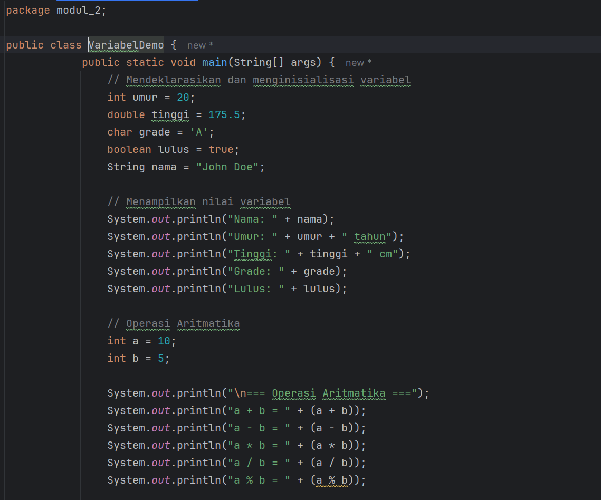
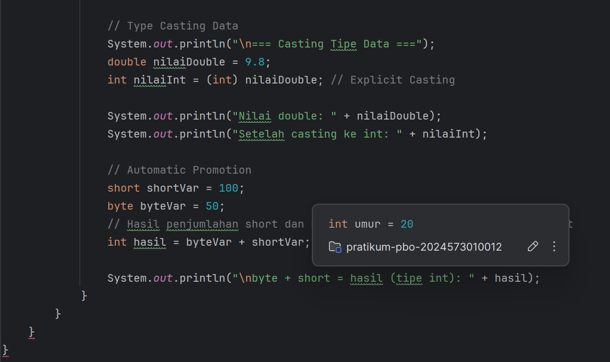

#### Screenshoot Hasil
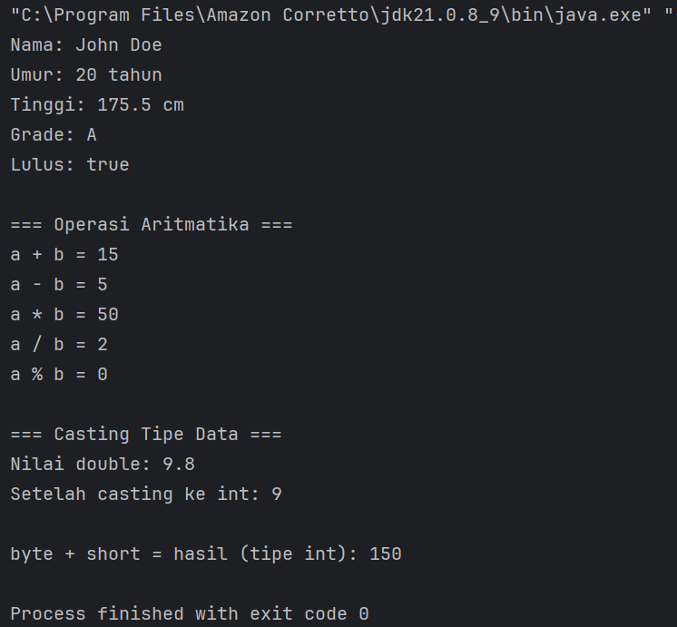

#### Analisa dan Pembahasan
Program VariabelDemo.java berhasil mendemonstrasikan penanganan data di Java.

1. Variabel dan Tipe Data: Nilai untuk tipe primitif (int, double, char, boolean) dan referensi (String) berhasil disimpan dan ditampilkan.

2. Operasi Aritmatika: Hasil operasi menunjukkan perilaku pembagian integer (10 / 5 = 2), di mana sisa pecahan dibuang.

3. Konversi Tipe Data:

- Explicit Casting: Konversi dari double (9.8) ke int (9) mengakibatkan kehilangan presisi (pecahan dibuang).

- Automatic Promotion: Operasi byte + short menghasilkan int (150). Ini membuktikan Java secara otomatis mempromosikan tipe data yang lebih kecil dari int untuk mencegah overflow dan memastikan keamanan perhitungan.

Secara keseluruhan, output ini memverifikasi implementasi dasar variabel dan aturan konversi tipe data Java.

### Pratikum 2 - Input, Output, dan Scanner

#### Dasar Teori
Praktikum ini berfokus pada interaksi antara program dan pengguna, menggunakan konsep Input/Output (I/O).

1. Output (Tampilan)
   System.out adalah objek yang digunakan untuk menampilkan data ke konsol.

- System.out.print(): Menampilkan data tanpa baris baru.

- System.out.println(): Menampilkan data diikuti baris baru.

2. Input (Masukan)
   Untuk membaca input dari pengguna, digunakan class Scanner dari package java.util.

- Wajib: import java.util.Scanner;

- Wajib: Membuat objek Scanner: Scanner input = new Scanner(System.in);

Metode Scanner Kunci

Scanner menyediakan metode khusus untuk membaca tipe data tertentu:

- nextLine(): Membaca seluruh baris teks (String), termasuk spasi.

- nextInt(): Membaca bilangan bulat (int).

- nextDouble(): Membaca bilangan pecahan (double).

Praktik Baik

Objek Scanner harus ditutup menggunakan input.close() setelah selesai digunakan untuk membebaskan sumber daya.

#### Langkah Pratikum
1. Import dan Membuat Scanner: Tambahkan import java.util.Scanner di awal file. Buat file baru bernama InputOutputDemo.java.

2. Ketik Kode Berikut: Salin kode program di bawah ini ke dalam file InputOutputDemo.java.
3. 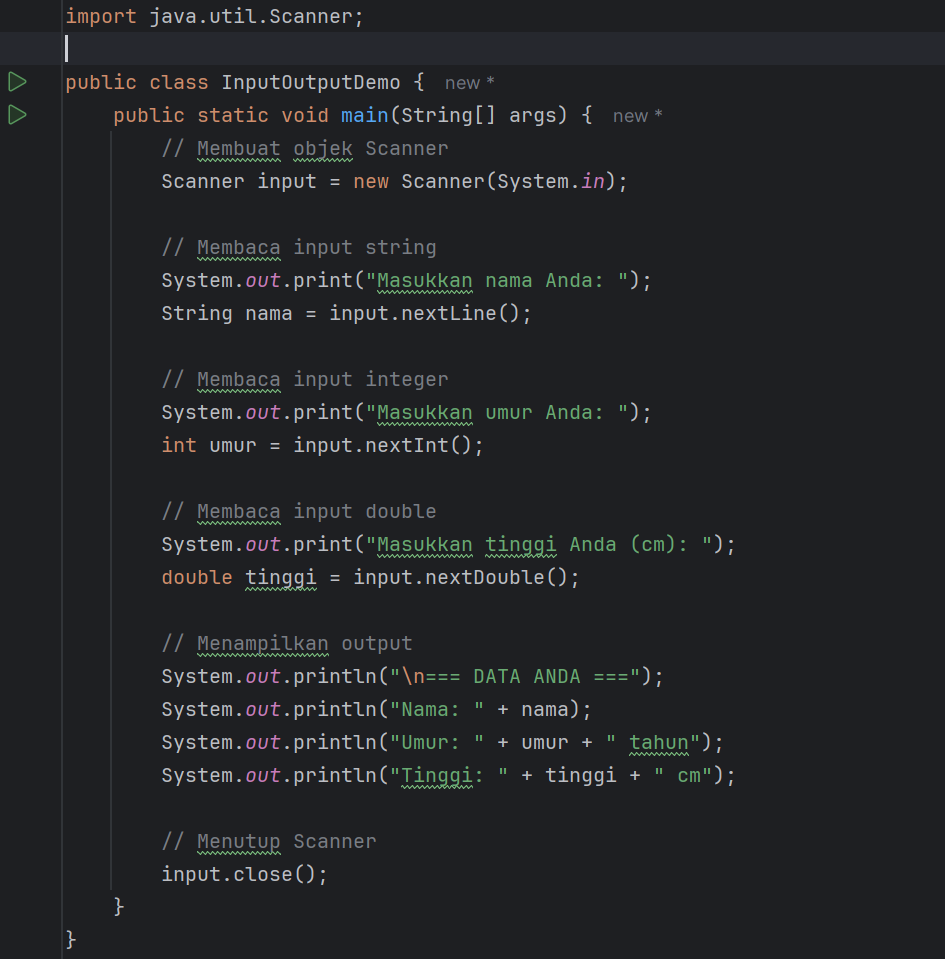
4. Kompilasi dan Jalankan: Jalankan program dan masukkan nilai yang diminta pada setiap prompt.

5. Ambil Screenshot: Ambil tangkapan layar dari hasil eksekusi (termasuk input dan output).

#### Screenshoot Hasil

#### Analisa dan Pembahasan
Program InputOutputDemo.java berhasil mendemonstrasikan interaksi pengguna menggunakan class Scanner.

1. Input Berhasil: Program sukses menerima tiga tipe data berbeda:

- String (tania ananda sari) menggunakan nextLine(), mempertahankan spasi.

- int (20) menggunakan nextInt().

- double (156) menggunakan nextDouble(), yang secara otomatis disimpan dan ditampilkan sebagai 156.0.

2. Output Terstruktur: Data yang diambil (Nama, Umur, Tinggi) ditampilkan kembali dengan benar ke konsol.

Output membuktikan bahwa program dapat secara akurat mengambil dan mengolah berbagai tipe data masukan dari pengguna.

### Pratikum 3 - Struktur Control: Percabangan

#### Dasar Teori
Struktur kontrol percabangan (Selection/Decision Control Structure) adalah alat fundamental dalam pemrograman yang memungkinkan program membuat keputusan dan menjalankan blok kode tertentu berdasarkan kondisi yang terpenuhi (true atau false). Java menyediakan tiga statement percabangan utama:

1. if Statement
   Digunakan untuk mengeksekusi satu blok kode hanya jika suatu kondisi bernilai true.

2. if-else dan if-else if-else Statement
   Memungkinkan program memilih antara dua atau lebih blok kode.

- if-else: Memilih antara dua kemungkinan.

- if-else if-else: Memilih dari beberapa kondisi yang berurutan. Kode akan berhenti pada kondisi true yang pertama kali ditemukan. Blok else akan dijalankan jika semua kondisi di atasnya bernilai false.

3. switch Statement
   Digunakan sebagai alternatif untuk percabangan if-else if yang panjang, terutama ketika kondisi melibatkan pengecekan nilai tunggal.

- Setiap nilai yang mungkin dicocokkan dengan case.

- break; wajib digunakan untuk menghentikan eksekusi dan keluar dari blok switch.

- default: dijalankan jika tidak ada case yang cocok.

4. Percabangan Bersarang (Nested if)
   -Terjadi ketika satu atau lebih statement if (atau if-else) diletakkan di dalam statement if yang lain. Ini berguna untuk mengecek beberapa kondisi secara hierarkis.

#### Langkah Pratikum
1. Import Scanner: Pastikan setiap kelas mengimpor java.util.Scanner;.

2. Buat Tiga Kelas: Buat tiga file Java terpisah, yaitu: GradeDemo.java, MenuDemo.java, dan NestedIfDemo.java.

3. Salin Kode: Salin kode program yang sesuai ke masing-masing file.
- GradeDemo
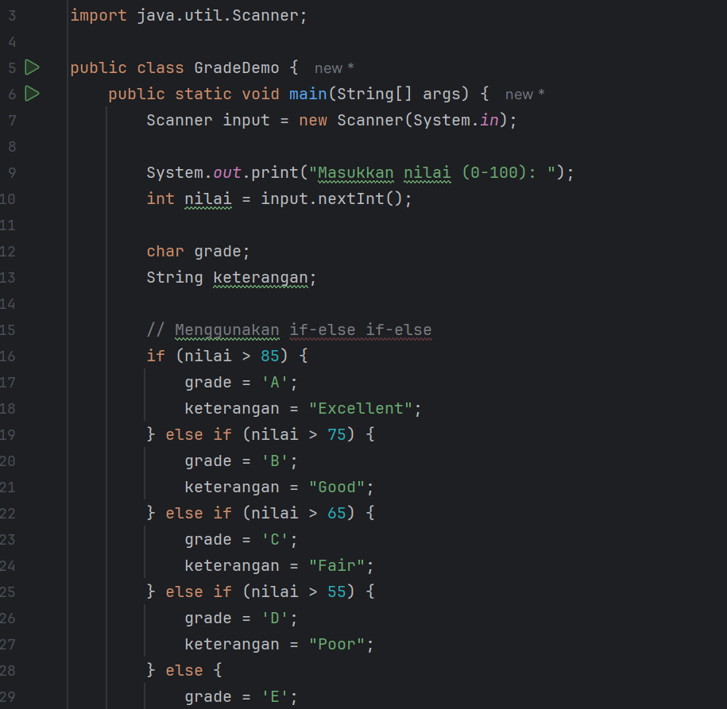
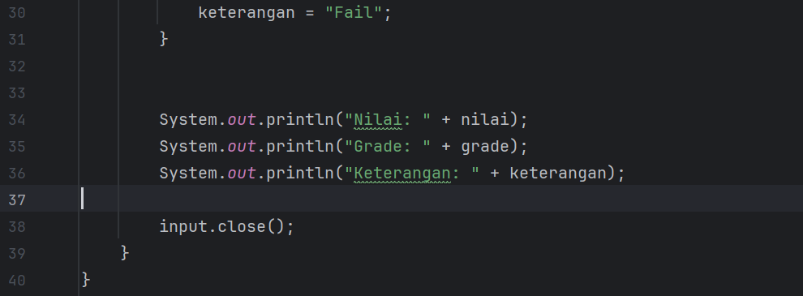

- MenuDemo
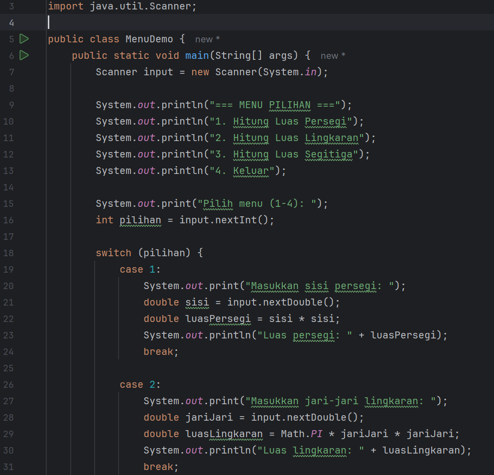
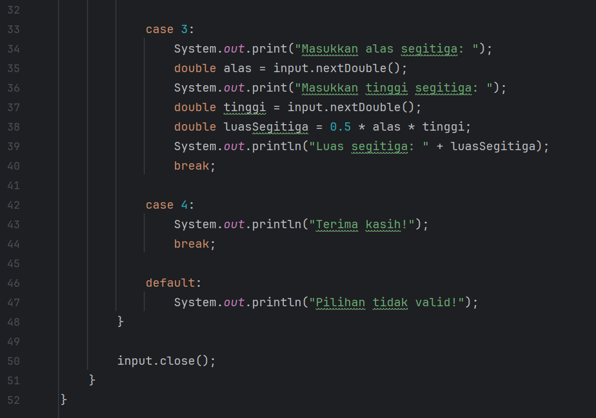

- NestedIfDemo
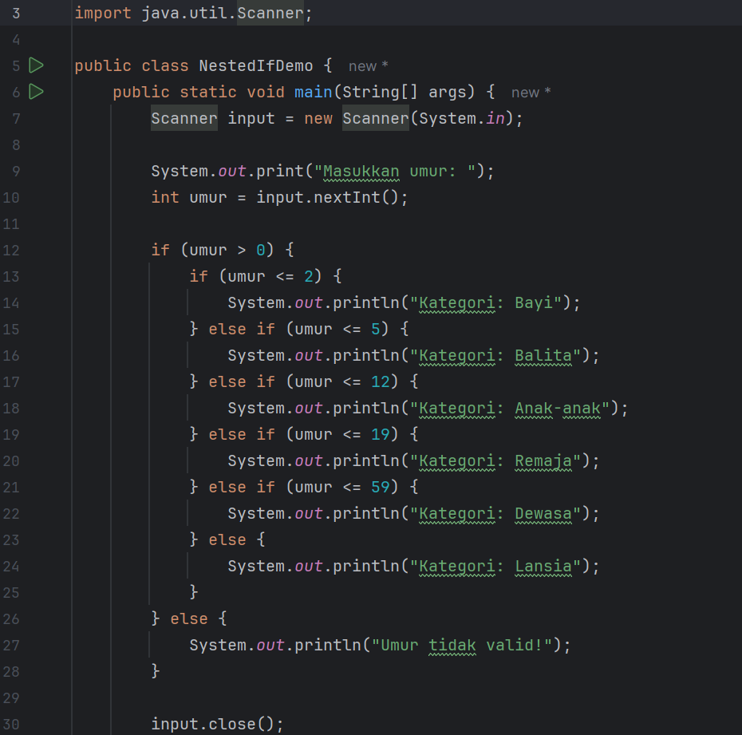

#### Screenshoot Hasil
- GradeDemo
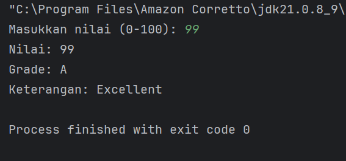

- MenuDemo
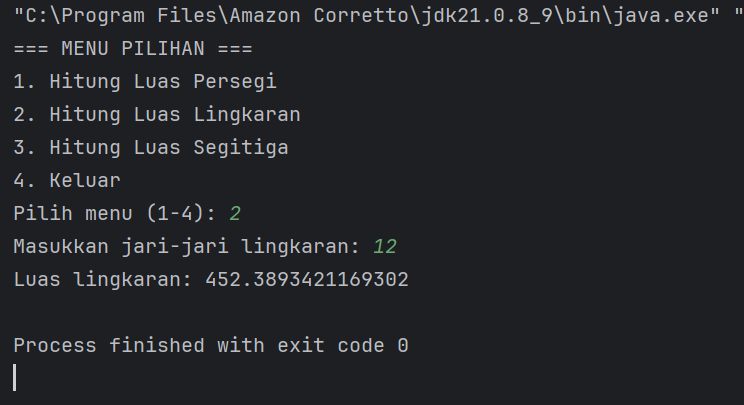

- NestedIfDemo

#### Analisa dan Pembahasan
1. Program GradeDemo.java (Output: Nilai 99)
   Analisa Output:

- Input: Nilai 99

- Output: Nilai: 99, Grade: A, Keterangan: Excellent

Pembahasan:

- Program menggunakan struktur if-else if-else berjenjang untuk menentukan grade.

- Ketika input nilai adalah 99, kondisi pertama yang diperiksa adalah if (nilai > 85).

- Karena 99>85 bernilai true, blok kode ini dieksekusi, menetapkan grade = 'A' dan keterangan = "Excellent".

- Program segera keluar dari seluruh blok if-else if-else tanpa mengecek kondisi yang tersisa (else if nilai > 75, dst.). Hasilnya, grade dan keterangan yang tepat telah diklasifikasikan.

2. Program MenuDemo.java (Output: Pilihan 2)
   Analisa Output:

- Pilihan Menu: 2

- Input Jari-jari: 12

- Output Luas Lingkaran: 452.3893421169302

Pembahasan:

- Program ini menggunakan statement switch untuk navigasi menu.

- Ketika pengguna memasukkan pilihan 2, program langsung mencocokkan nilai tersebut dengan case 2.

- Kode di dalam case 2 dieksekusi:

1. Meminta input jariJari (12).

2. Menghitung luasLingkaran menggunakan rumus Luas=π×r×r (3.14159...×12×12).

3. Menampilkan hasil perhitungan (452.389...).

- Penggunaan break; memastikan bahwa program berhenti setelah case 2 selesai, mencegah eksekusi kode di case 3 dan seterusnya (fall-through).

3. Program NestedIfDemo.java (Output: Umur 21)
   Analisa Output:

- Input: Umur 21

- Output: Kategori: Dewasa

Pembahasan:

- Program menggunakan struktur percabangan bersarang (Nested if) untuk validasi dan klasifikasi usia.

- Pertama, if luar (if (umur > 0)) dievaluasi: 21>0 bernilai true, sehingga program melanjutkan ke blok if-else if-else di dalamnya.

- Di dalam, kondisi dievaluasi berurutan:

1. if (umur <= 2): 21≤2 (False)

2. else if (umur <= 5): 21≤5 (False)

3. else if (umur <= 12): 21≤12 (False)

4. else if (umur <= 19): 21≤19 (False)

- Kondisi else if (umur <= 59) dievaluasi: 21≤59 bernilai true. Blok kode ini dieksekusi dan menetapkan Kategori: Dewasa.

- Hasil ini membuktikan bahwa logika berjenjang pada Nested if bekerja dengan benar, mengklasifikasikan umur 21 ke dalam kategori Dewasa sebelum mencapai kondisi Lansia.

### Pratikum 4 - Struktur Control: Perulangan

#### Dasar Teori
Struktur kontrol perulangan (Loop) digunakan untuk mengulang eksekusi satu blok kode berkali-kali sampai kondisi tertentu tidak lagi terpenuhi. Java menyediakan tiga jenis perulangan utama:

1. Perulangan For (For Loop)  
   Digunakan ketika jumlah iterasi (pengulangan) sudah diketahui secara pasti di awal.

- Sintaks: for (inisialisasi; kondisi; increment/decrement)

1. Inisialisasi: Dijalankan satu kali di awal untuk mengatur counter.

2. Kondisi: Diperiksa sebelum setiap iterasi. Jika true, perulangan berlanjut. Jika false, perulangan berhenti.

3. Increment/Decrement: Dijalankan di akhir setiap iterasi untuk memodifikasi counter. 

2. Perulangan While (While Loop)   
   Digunakan ketika jumlah iterasi tidak pasti dan perulangan bergantung pada kondisi yang bisa berubah selama eksekusi.

- Sintaks: while (kondisi)

- Blok kode di dalamnya akan diulang selama kondisi bernilai true. Kondisi dicek sebelum blok kode pertama kali dijalankan.

3. Perulangan Do-While (Do-While Loop)  
   - Mirip dengan while, tetapi menjamin bahwa blok kode dieksekusi minimal satu kali, karena kondisi perulangan dicek setelah blok kode dijalankan.

- Sintaks: do { // kode } while (kondisi);

4. Perulangan Bersarang (Nested Loop)  
   - Terjadi ketika satu perulangan (luar) mengandung perulangan lain (dalam). Perulangan dalam akan diselesaikan sepenuhnya untuk setiap satu iterasi perulangan luar. Ini umum digunakan untuk mencetak pola, matriks, atau tabel.
   
#### Langkah Pratikum
1. Import Scanner (Jika Perlu): Hanya kelas WhileLoopDemo yang membutuhkan import java.util.Scanner;.

2. Buat Tiga Kelas: Buat tiga file Java terpisah: ForLoopDemo.java, WhileLoopDemo.java, dan NestedLoopDemo.java.

3. Salin Kode: Salin kode program yang sesuai ke masing-masing file yang telah dibuat.
- ForLoopDemo
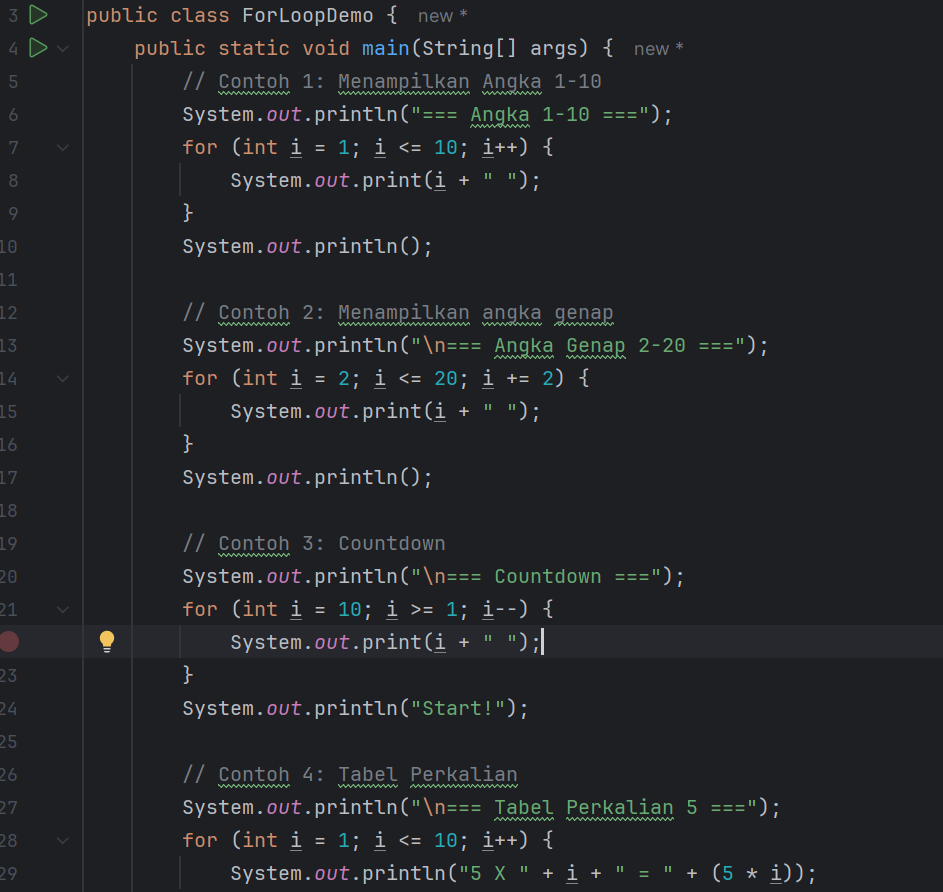

- WhileLoopDemo
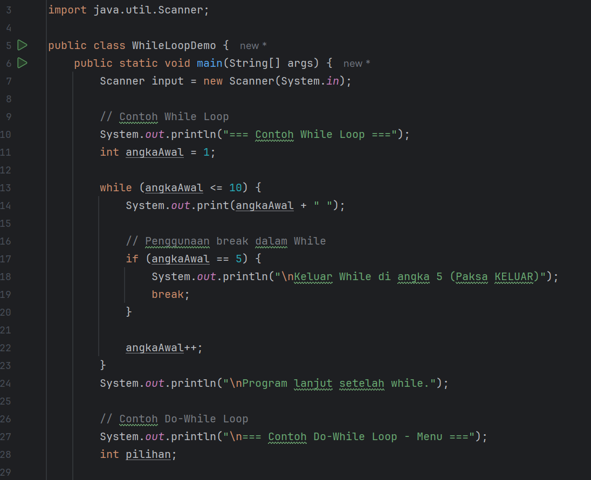

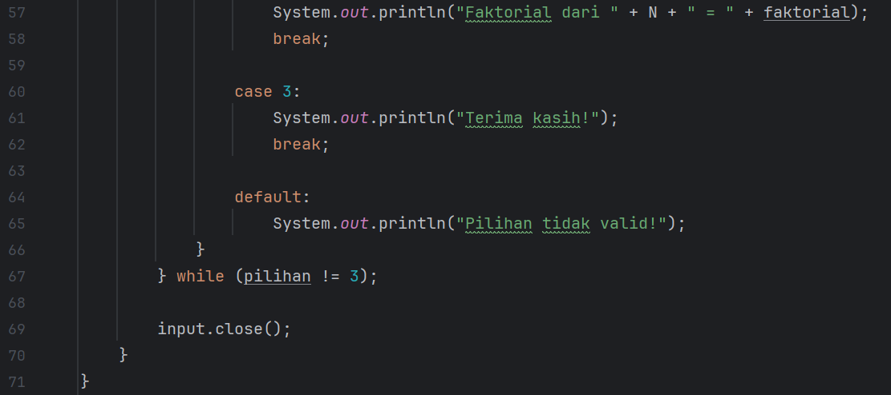

- NestedLoopDemo

#### Screenshoot Hasil
- ForLoopDemo
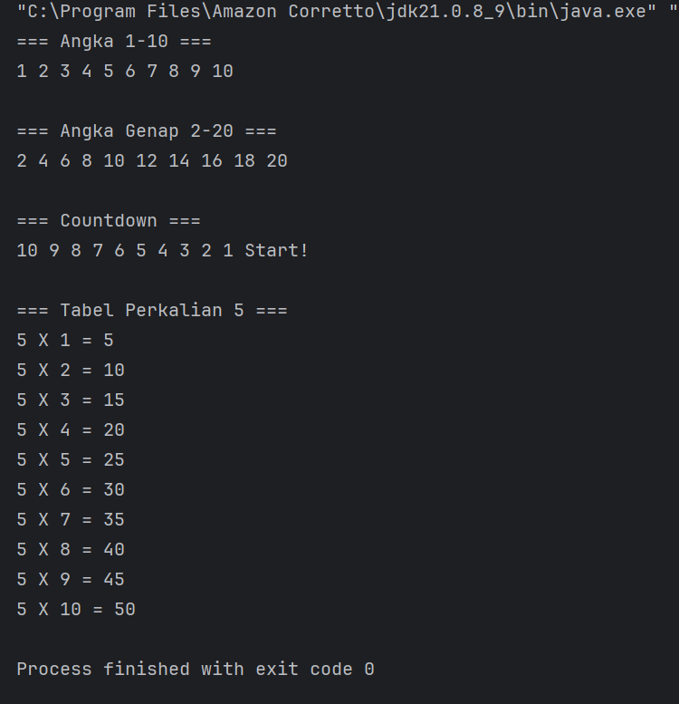

- WhileLoopDemo
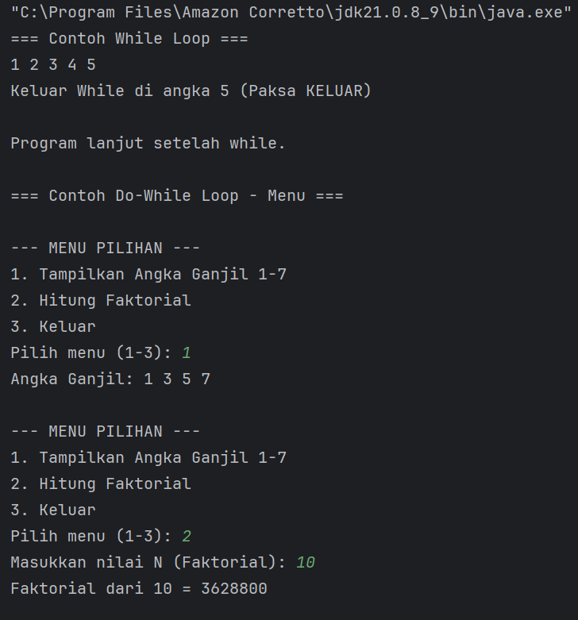
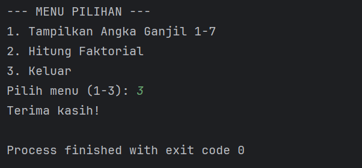

- NestedLoopDemo
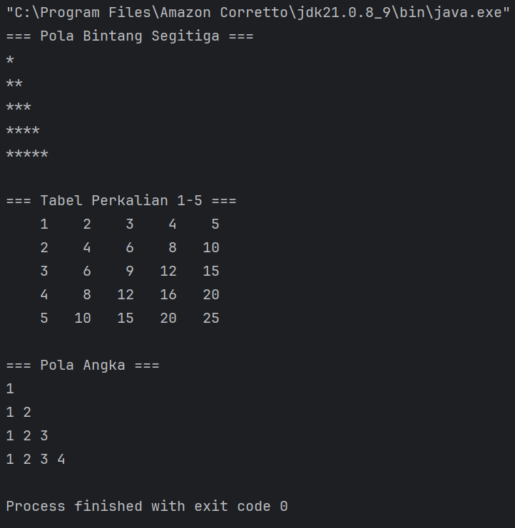

#### Analisa dan Pembahasan
1. ForLoopDemo  
Berhasil melakukan iterasi terstruktur (naik, turun, dan lompatan 2) dan menghasilkan Tabel Perkalian yang teratur.

2. WhileLoopDemo  
   - While Loop menggunakan statement break untuk memaksa perulangan berhenti di angka 5, membuktikan kontrol alur yang fleksibel.
    - Do-While berhasil mengendalikan menu interaktif dan memastikan menu tampil minimal satu kali sebelum program keluar (dengan input 3).

3. NestedLoopDemo  
   Berhasil menggunakan dua perulangan bersarang untuk mencetak pola dua dimensi, yaitu Segitiga Bintang/Angka dan Tabel Perkalian 5×5.

Secara keseluruhan, output ini memverifikasi implementasi dasar dari ketiga jenis perulangan Java untuk kontrol iterasi yang terstruktur dan dinamis.

---

## 3. Kesimpulan

Berdasarkan pelaksanaan Praktikum 1 hingga Praktikum 4, dapat disimpulkan bahwa Struktur Dasar Pemrograman Java terdiri dari tiga pilar utama: pengelolaan data, kontrol keputusan, dan kontrol iterasi.

1. Pengelolaan Data (Praktikum 1 & 2)
   - Variabel dan Tipe Data: Java memerlukan deklarasi tipe data yang eksplisit (int, double, String, dll.) untuk mengalokasikan memori yang tepat. Perbedaan antara Tipe Primitif (nilai langsung) dan Tipe Referensi (String) sangat fundamental.

    - Konversi Tipe: Proses casting dan promotion sangat penting untuk menghindari error. Explicit Casting ((int)) menyebabkan hilangnya presisi, sementara Automatic Promotion (misalnya, byte ke int) adalah mekanisme keamanan Java untuk memastikan hasil aritmatika akurat.

    - I/O Interaktif: Class java.util.Scanner adalah alat penting untuk interaksi dinamis, di mana pemilihan metode (nextLine(), nextInt(), nextDouble()) harus sesuai dengan tipe data yang diharapkan untuk mencegah runtime error.

2. Struktur Kontrol: Percabangan (Praktikum 3)  
   Struktur kontrol percabangan memungkinkan program membuat keputusan, memilah-milah alur kerja, dan memberikan respons yang bervariasi.

    - If-Else If-Else (GradeDemo): Digunakan untuk evaluasi kondisi berjenjang. Program akan berhenti pada kondisi true yang pertama kali ditemukan, memastikan grade yang diberikan adalah yang paling tinggi dan sesuai.

    - Switch (MenuDemo): Lebih efisien daripada if-else if yang panjang untuk membandingkan nilai tunggal. Penggunaan break di setiap case adalah wajib untuk mencegah fall-through ke case berikutnya.

    - Percabangan Bersarang (Nested If): Digunakan untuk menguji kondisi secara hierarkis. Contoh pada NestedIfDemo menunjukkan bahwa if luar berfungsi sebagai validasi awal (umur > 0) sebelum if dalam melakukan klasifikasi yang lebih detail.

3. Struktur Kontrol: Perulangan (Praktikum 4)  
   Perulangan memungkinkan efisiensi dengan mengulang blok kode.

    - For Loop: Paling cocok ketika jumlah iterasi sudah diketahui (misalnya, mencetak angka 1−10 atau tabel perkalian). Ia memiliki struktur yang ringkas untuk inisialisasi, kondisi, dan perubahan counter.

    - While dan Do-While: Cocok ketika jumlah iterasi belum pasti. Do-While ideal untuk menu interaktif, menjamin eksekusi minimal satu kali. Kontrol perulangan juga dapat dimanipulasi secara paksa menggunakan statement break (seperti yang ditunjukkan pada WhileLoopDemo).

    - Perulangan Bersarang: Digunakan secara efektif untuk menghasilkan pola dua dimensi (misalnya, Pola Bintang) atau memproses data tabular, di mana perulangan dalam diselesaikan sepenuhnya untuk setiap langkah perulangan luar.

Kesimpulan Akhir: Keempat praktikum ini berhasil membentuk pemahaman dasar dalam membuat program Java yang fungsional, dimulai dari mendefinisikan data, mengambil input, hingga membuat program mampu mengambil keputusan dan mengulang tugas secara terstruktur.

---

## 5. Referensi
Java Basics (Variables, Data Types, Control Flow) - https://docs.oracle.com/javase/tutorial/java/index.html

Java Scanner Class (Input/Output) - https://docs.oracle.com/javase/8/docs/api/java/util/Scanner.html

Control Flow Statements (If-Else, Switch, Loops) - https://www.w3schools.com/java/java_conditions.asp

---

