# Laporan Modul 3. Dasar pemrograman Java
**Mata Kuliah:** Partikum Pemrograman Berorientasi Objek
**Nama:** [Tania Ananda Sari]  
**Nim:** [2024573010012]  
**Kelas:** [TI-2E]

---

## 1. Abstrak

Laporan ini membahas hasil pelaksanaan Praktikum Modul 3: Dasar Pemrograman Java Lanjutan yang menitikberatkan pada tiga konsep utama yaitu Array, Method/Function, dan Pengolahan Data Teks (String). Tujuan praktikum ini adalah untuk memperdalam pemahaman mahasiswa terhadap konsep dasar pemrograman berorientasi objek melalui penerapan fungsi, manipulasi data berbasis teks, serta pengelolaan data menggunakan struktur array satu dan dua dimensi. Selama kegiatan praktikum, mahasiswa dilatih untuk menulis kode secara sistematis, mengidentifikasi kesalahan logika, dan melakukan analisis terhadap hasil keluaran program. Hasil yang diperoleh menunjukkan bahwa mahasiswa mampu memahami konsep pemrosesan data, penggunaan metode, serta penerapan prinsip modularitas dalam bahasa Java. Diharapkan laporan ini dapat menjadi dasar pemahaman untuk modul lanjutan mengenai penerapan algoritma dan struktur data yang lebih kompleks.

---
## 2. Pratikum
### Pratikum 1.1 - Array Satu Dimensi

#### Dasar Teori
1. Pengertian Dasar Pemrograman Java Lanjutan

Pemrograman Java lanjutan merupakan kelanjutan dari konsep dasar pemrograman sebelumnya, dengan fokus pada penerapan logika dan efisiensi dalam penulisan kode. Pada tahap ini, mahasiswa belajar menulis kode yang tidak hanya berjalan dengan benar, tetapi juga terstruktur, mudah dipahami, dan dapat dikembangkan lebih lanjut. Materi pada modul ini meliputi penggunaan array, method/function, dan string.

2. Array

Array adalah struktur data yang digunakan untuk menyimpan sejumlah elemen dengan tipe data yang sama dalam satu variabel. Setiap elemen dalam array memiliki indeks yang dimulai dari 0.
Contoh array satu dimensi: int[] nilai = {80, 90, 75, 88, 95);

#### Langkah Pratikum
1. Membuat package modul_3 dan class ArraySatuDimensi.java.

2. Mendeklarasikan dan menginisialisasi array integer nilaiSiswa.

3. Menambahkan perulangan enhanced for untuk mencari nilai tertinggi dan terendah dalam array.

4. Menampilkan hasil array dan nilai ekstrem.

Kode Program: ArrayDuaDimensi. java
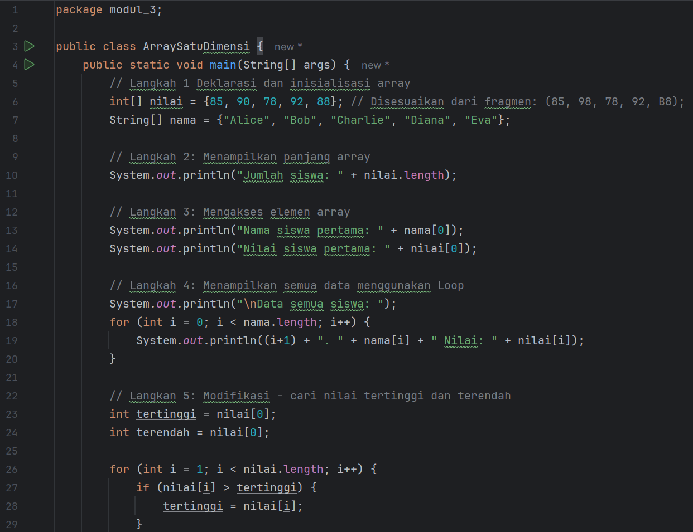
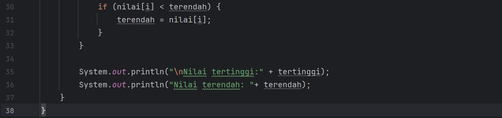

#### Screenshoot Hasil
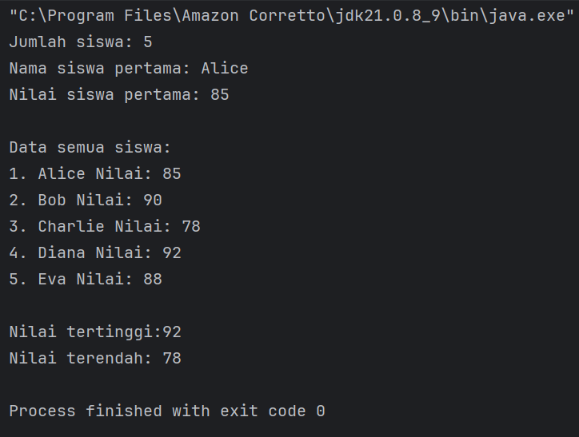

#### Analisa dan Pembahsan
Output tersebut menunjukkan hasil eksekusi program Array Satu Dimensi di Java yang berhasil:

1. Menyimpan dan Menampilkan data 5 siswa (Alice, Bob, Charlie, Diana, Eva) beserta nilai mereka.

2. Menganalisis Data untuk menemukan:

- Nilai Tertinggi: 92 (Diana).

- Nilai Terendah: 78 (Charlie).

Program membuktikan kemampuan mengolah data, mengakses elemen array, dan menggunakan perulangan untuk analisis.

### Tugas Pratikum 1.1 
1. Di dalam package modul_3, buatkan sebuah package baru dengan nama latihan
2. Buatkan sebuah class baru dengan nama latihan.java. Selesaikan tugas berikut: Buat array untuk menyimpan nilai ujian 10 siswa, kemudian hitung dan tampilkan rata-rata nilai, kemmudian cari dan tampilkan nilai tertinggi dan terendah.

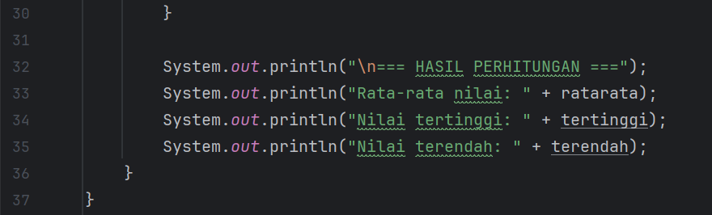

#### Screenshoot Hasil
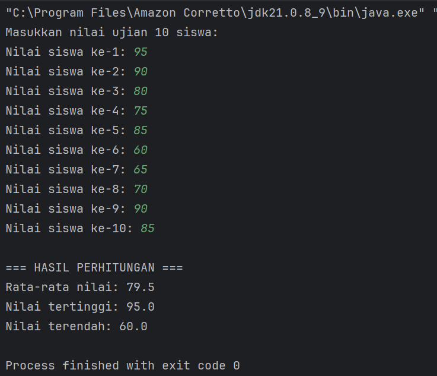

#### Analisa dan Pembahasan
Output menunjukkan keberhasilan program dalam memproses 10 nilai ujian.

Analisa Ringkas
1. Input Terpenuhi: Program berhasil menerima dan menyimpan 10 nilai dari pengguna (95 hingga 85).

2. Perhitungan Akurat: Program menghitung dan menampilkan hasil statistik dengan tepat:

- Rata-rata: 79.5

- Nilai Tertinggi: 95.0

- Nilai Terendah: 60.0

Hal ini membuktikan implementasi array satu dimensi dan logika perulangan untuk perhitungan rata-rata, maksimum, dan minimum berfungsi dengan baik.

### Pratikum 1.2 - Array Dua Dimensi

#### Dasar Teori
Array dua dimensi adalah bentuk lanjutan dari array satu dimensi, di mana setiap elemen array tidak hanya memiliki satu indeks, tetapi dua indeks yang disebut indeks baris dan indeks kolom. Array dua dimensi bisa diibaratkan seperti tabel yang memiliki baris dan kolom. Array dua dimensi sangat berguna untuk menyimpan data yang bentuknya seperti tabel, misalnya data nilai beberapa siswa pada beberapa mata pelajaran.

#### Langkah Pratikum
1. Membuat class ArrayDuaDimensi.java.

2. Mendeklarasikan array 2D nilai yang merepresentasikan nilai 3 siswa untuk 4 mata pelajaran.

3. Menjalankan program dan menganalisis struktur data.

Kode Program: ArrayDuaDimensi.java 

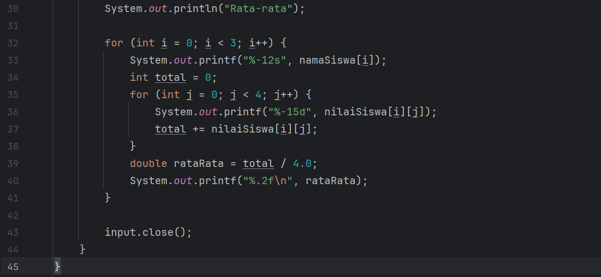

#### Screenshoot Hasil

#### Analisa dan Pembahasan
Output tersebut adalah hasil dari program Array Dua Dimensi yang digunakan untuk menampilkan data nilai siswa dan rata-rata mereka.

Analisa Ringkas
- Tujuan Program: Menyimpan dan menampilkan nilai 3 siswa (Alice, Bob, Charlie) pada 4 mata pelajaran (Matematika, Bahasa Indonesia, IPA, IPS) dalam format tabel.

- Struktur Data: Menggunakan array dua dimensi ([3][4]), di mana baris merepresentasikan siswa dan kolom merepresentasikan mata pelajaran.

- Fungsi Utama: Berhasil melakukan kalkulasi horizontal (per baris) untuk menghitung rata-rata nilai setiap siswa dan menampilkannya dengan format dua desimal (contoh: 82.50, 77.50, 87.50).

Program dieksekusi dengan sukses, membuktikan penggunaan nested loop (perulangan bersarang) untuk memproses data tabular berjalan sesuai rencana.

### Tugas Pratikum 1.2 
1. Buatkan sebuah class baru dengan nama latihan2.java didalam package latihan. Selesaikan tugas berikut:
    Dari kode pratikum diatas.
    - Tambahkan fitur untuk menampilkan mata pelajaran dengan nilai tertinggi untuk setiap siswa
    - Hitung rata-rata nilai untuk setiap mata pelajaran.
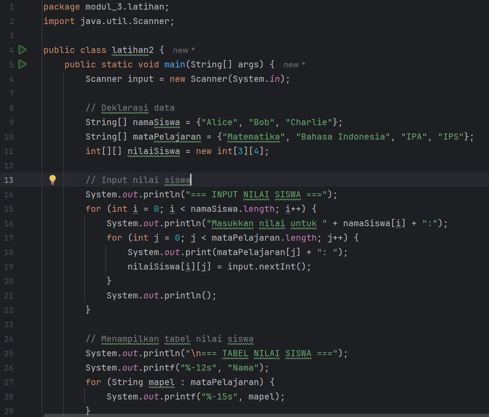
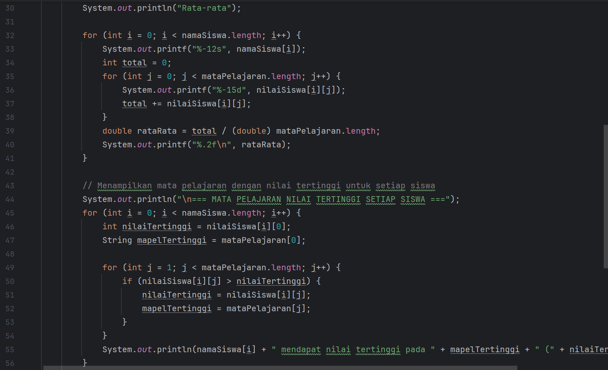
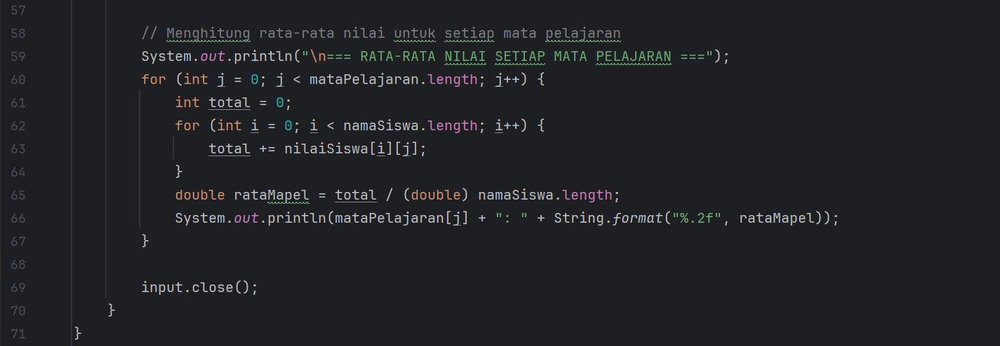

#### Screenshoot Hasil
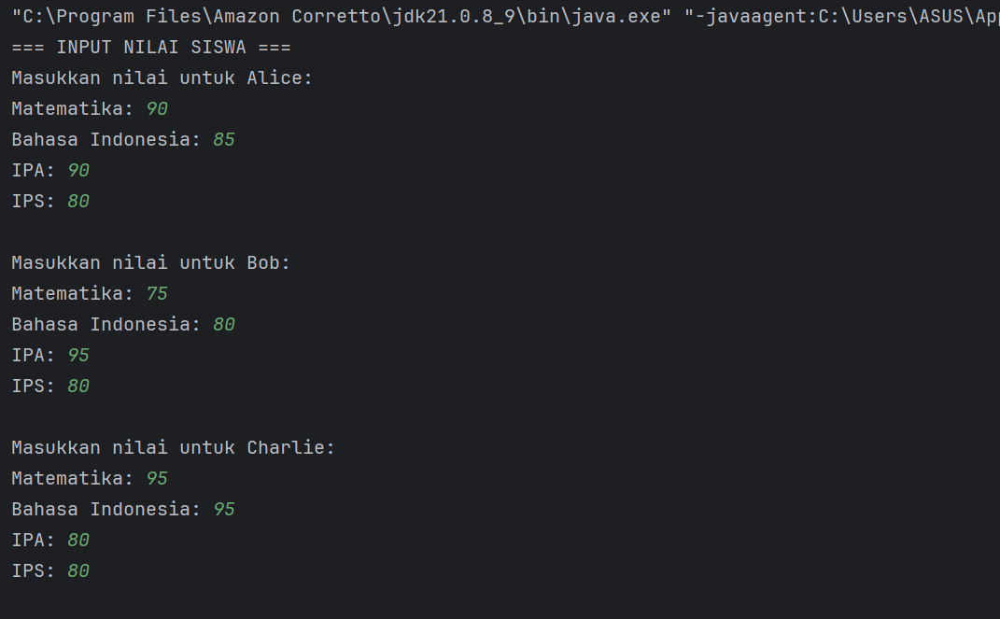
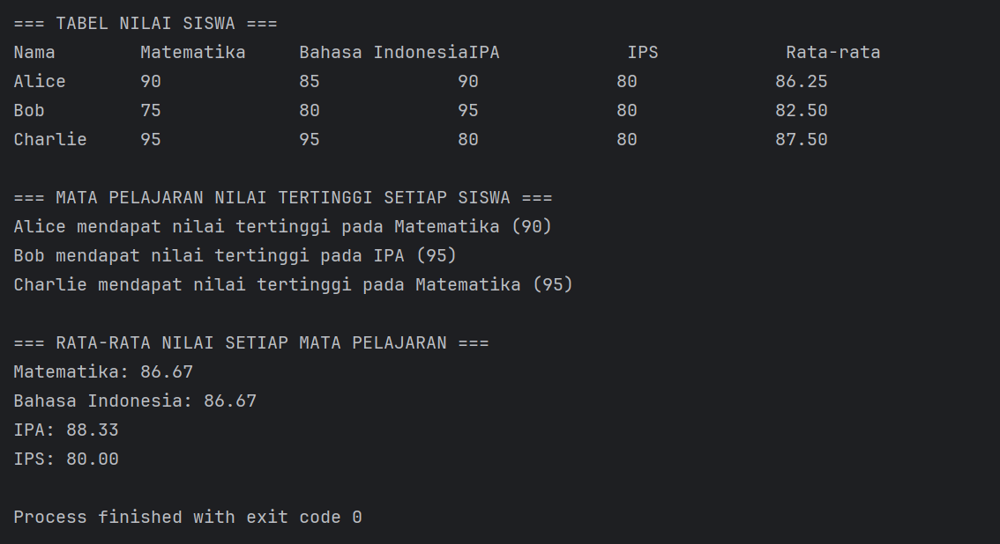

#### Analisa adan pembahasan
Analisa Ringkas Output Method Dasar
- Tujuan Program: Mendemonstrasikan penggunaan Method dalam Java untuk kalkulasi aritmetika.

- Method void (Non-Return): Digunakan untuk tugas tampilan, yaitu mencetak header (PROGRAM KALKULATOR SEDERHANA) dan menampilkan hasil akhir setiap operasi (misalnya, tampilkanHasil()).

- Method return (Mengembalikan Nilai): Digunakan untuk melakukan pemrosesan data, yaitu empat operasi aritmetika (tambah, kurang, kali, bagi).

- Hasil: Program berhasil memisahkan logika kalkulasi dari logika tampilan, menghasilkan hasil yang benar untuk operasi antara 15.50 dan 4.20:

    - Penjumlahan: 19.70

    - Pengurangan: 11.30

    - Perkalian: 65.10

    - Pembagian: 3.69

Program ini membuktikan prinsip modularitas kode bekerja dengan sukses.

### Pratikum 2.1 - Method Dasar

#### Dasar Teori
Method atau fungsi adalah blok kode yang digunakan untuk menjalankan tugas tertentu. Penggunaan method membuat program lebih terstruktur, efisien, dan mudah dikelola karena menghindari pengulangan kode.
Jenis-jenis method meliputi:

- Static Method: dipanggil tanpa membuat objek.

- Non-Static Method: dipanggil melalui objek.

- Void Method: tidak mengembalikan nilai.

- Return Method: mengembalikan nilai hasil proses.

#### Langkah Pratikum
1. Membuat class MethodDasar.java.

2. Membuat method tampilkanHeader() dan tampilkanHasil().

3. Membuat method operasi matematika (tambah, kurang, kali, bagi).

4. Membuat method validasiAngka().

5. Memanggil semua method di main.

Kode Program: MethodDasar.java
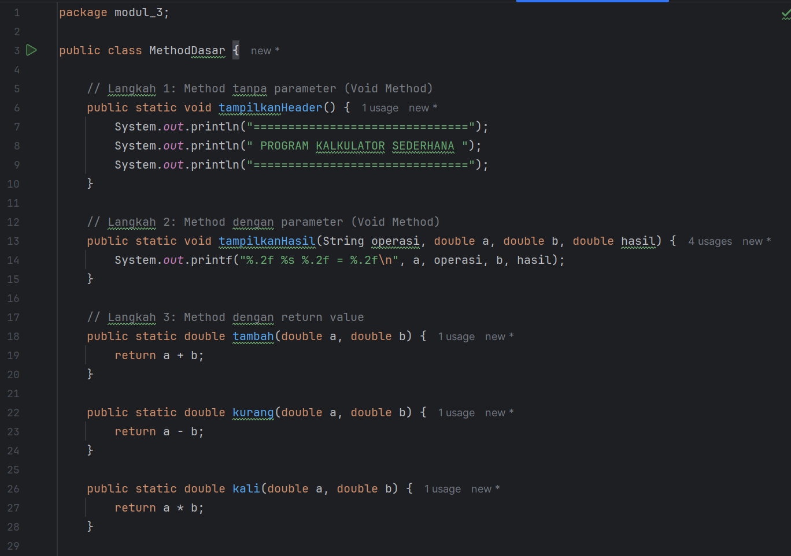
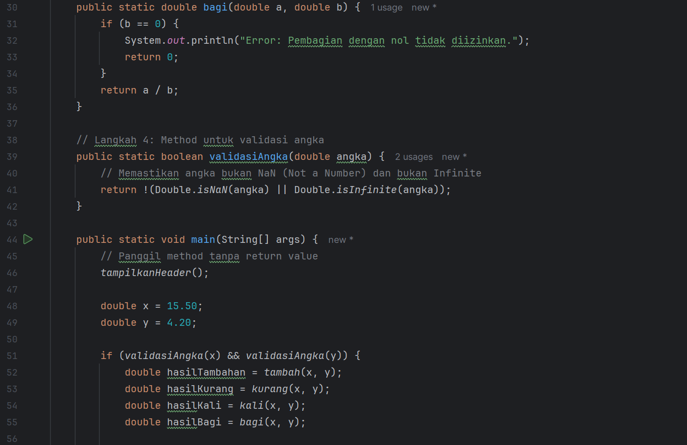
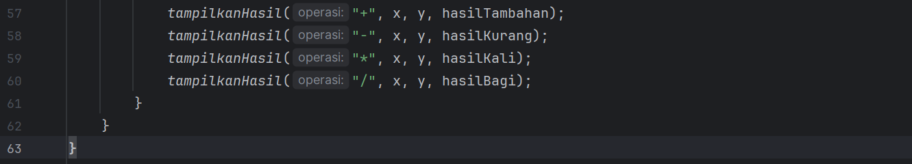

#### Screenshoot Hasil
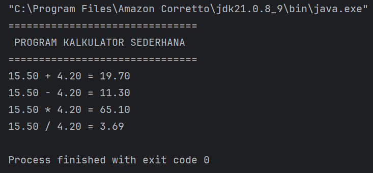

#### Analisa dan Pembahasan
Berikut adalah analisa ringkas dari output program Array dan Method Lanjutan:

Analisa Ringkas Output Array & Method
Program ini sukses mengombinasikan Array dan Method untuk pengolahan data statistik pada 10 nilai.

1. Data dan Pengurutan: Data awal ({88, 92, 75, ...}) berhasil diurutkan secara naik (ascending) oleh method pengurutan, menghasilkan array terurut ({60, 70, 75, ...}).

2. Hasil Analisis: Method yang berbeda berhasil menghitung semua statistik yang diminta:

- Nilai Maksimum: 99

- Nilai Minimum: 60

- Rata-rata: 85.4

- Median: 86.5 (Rata-rata dua nilai tengah dari 10 data yang terurut: 85 dan 88).

Program ini menunjukkan modularitas yang efektif karena setiap tugas analisis (mengurutkan, mencari maks/min, menghitung rata-rata/median) dipisahkan dalam method yang spesifik.

### Tugas Pratikum 1.3
1. Buatkan sebuah class baru dengan nama latihan3.java di dalam package latihan. Selesaikan tugas berikut.
    Dari kode pratikum diatas
    - Tambahkan Method untuk operasi pangkat dan akar kuadrat
    - Buat method untuk validasi operasi pembagian dengan nol
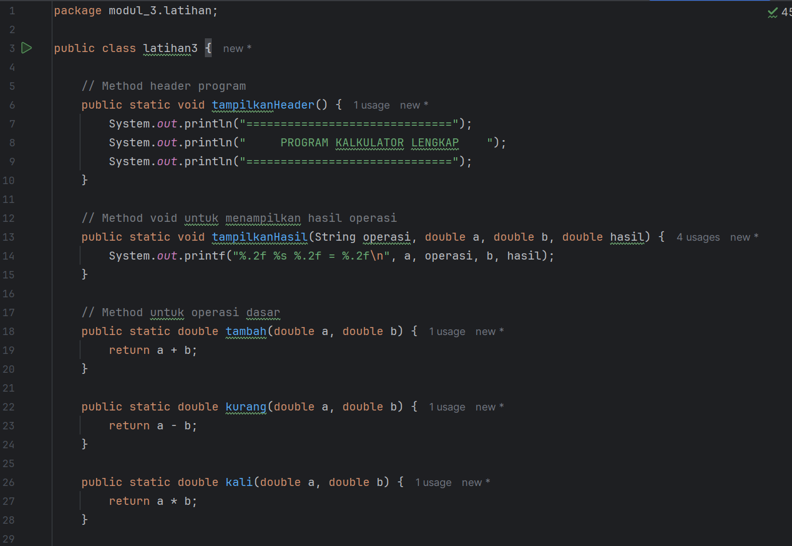
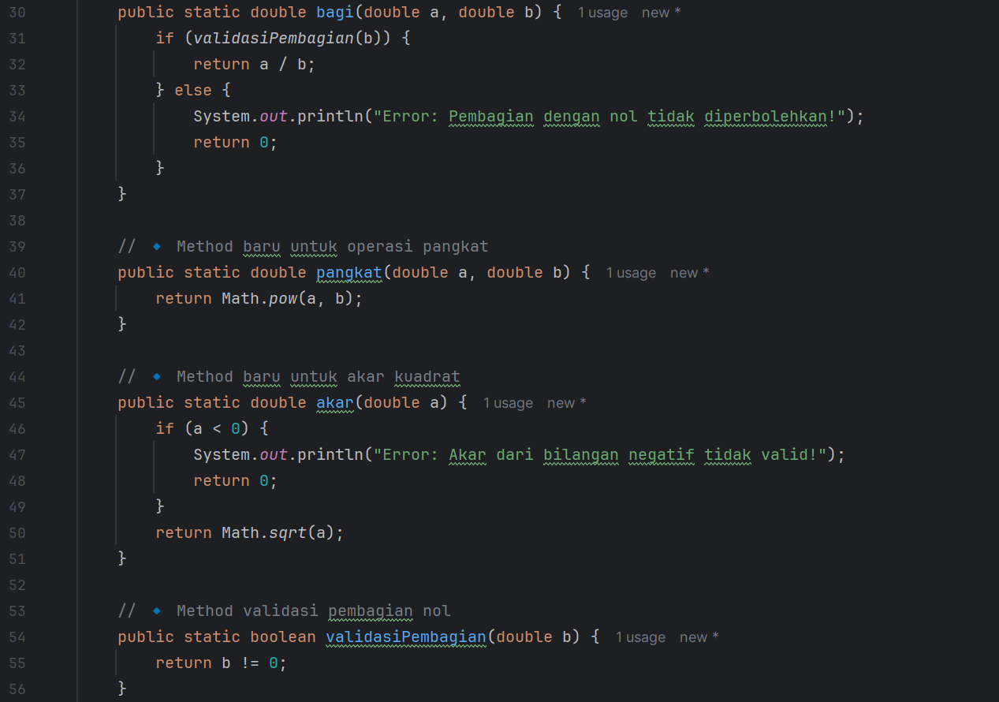
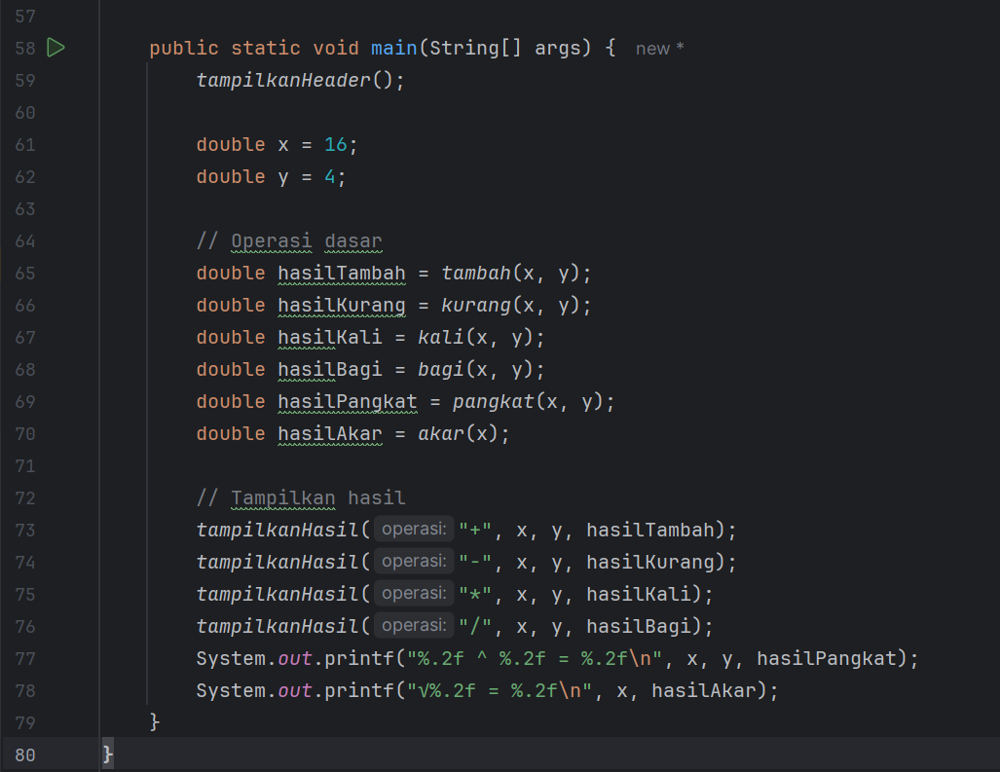

#### Screenshoot Hasil
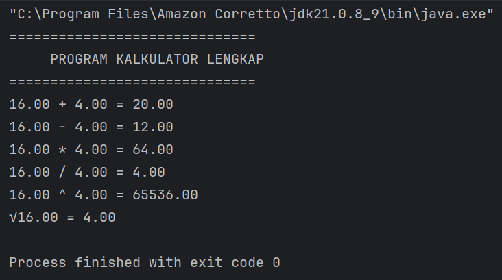

#### Analisa dan Pembahasan
Analisa ringkas dari output program Manipulasi String ini adalah:

Analisa Ringkas Output Manipulasi String
Program ini sukses mendemonstrasikan kemampuan pemrosesan teks yang kompleks menggunakan method dalam Java.

- Tujuan Program: Melakukan dua manipulasi string pada kalimat input:

1. Menghitung jumlah konsonan.

2. Mengubah format string menjadi Pascal Case (Setiap kata diawali huruf Kapital).

- Penghitungan Konsonan: Program berhasil mengidentifikasi dan menghitung 17 konsonan dengan memfilter karakter yang merupakan huruf, tetapi bukan vokal.

- Format Pascal Case: Program berhasil mengubah "hari ini praktikum pemrograman java" menjadi "Hari Ini Praktikum Pemrograman Java". Hal ini dicapai dengan memecah string menjadi kata-kata, lalu mengkapitalisasi huruf pertama setiap kata, dan menggabungkannya kembali.

Secara keseluruhan, program menunjukkan modularitas dan efisiensi dalam mengolah data teks.

### Pratikum 2.2 - Method dengan Array

#### Dasar Teori
Konsep Method dengan Array adalah praktik pemrograman di mana seluruh struktur data Array digunakan sebagai parameter atau nilai balik (return value) dari sebuah method (fungsi). Tujuannya adalah untuk mencapai prinsip modularitas dan efisiensi kode.

Fungsi Utama: Memisahkan Tugas Logika 
1. Array sebagai Input (Parameter): Array dikirimkan ke method agar method tersebut dapat melakukan tugas spesifik pada kumpulan data tersebut. Contoh:

- Method hitungRataRata(int[] nilai): Bertugas menjumlahkan semua elemen array nilai dan menghitung rata-ratanya.

- Method urutkan(int[] data): Bertugas memproses array data hingga elemennya tersusun secara berurutan.

2. Array sebagai Output (Return Value): Kadang-kadang, method tidak hanya memproses, tetapi juga menghasilkan array baru (misalnya, array hasil pengurutan atau array yang telah dimodifikasi). Dalam kasus ini, tipe balik (return type) dari method adalah tipe array (contoh: int[]).

Keuntungan Utama
- Kode Bersih: Logika pemrosesan data yang kompleks (seperti pencarian nilai maksimum atau pengurutan) dipindahkan dari method utama (main), sehingga main hanya berisi alur kerja yang tinggi.

- Dapat Digunakan Kembali (Reusability): Satu method pemrosesan array dapat digunakan berulang kali untuk menganalisis array data yang berbeda, selama tipe datanya sama.

#### Langkah Pratikum
1. Membuat class ArrayMethod.java.
2. Membuat method inputArray(), tampilkanArray(), CariMaksimum(), cariMinimum(),hitungRata-rata(), dan urutkanArray().
3. maunggunakan Scanner untuk input dinamis
4. UrutkanArray(), memakai algoritma Bubble Sort.
5. Semua method dipanggil di main.

Kode Program: ArrayMethod.java
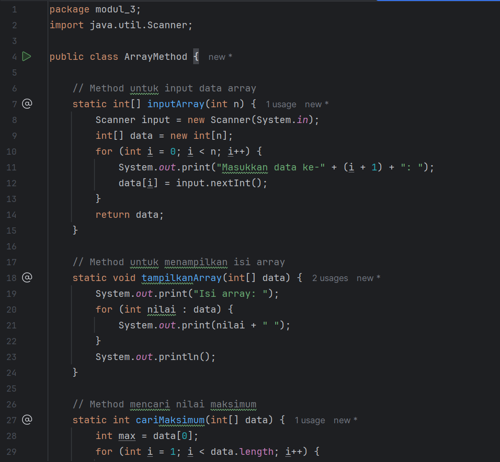
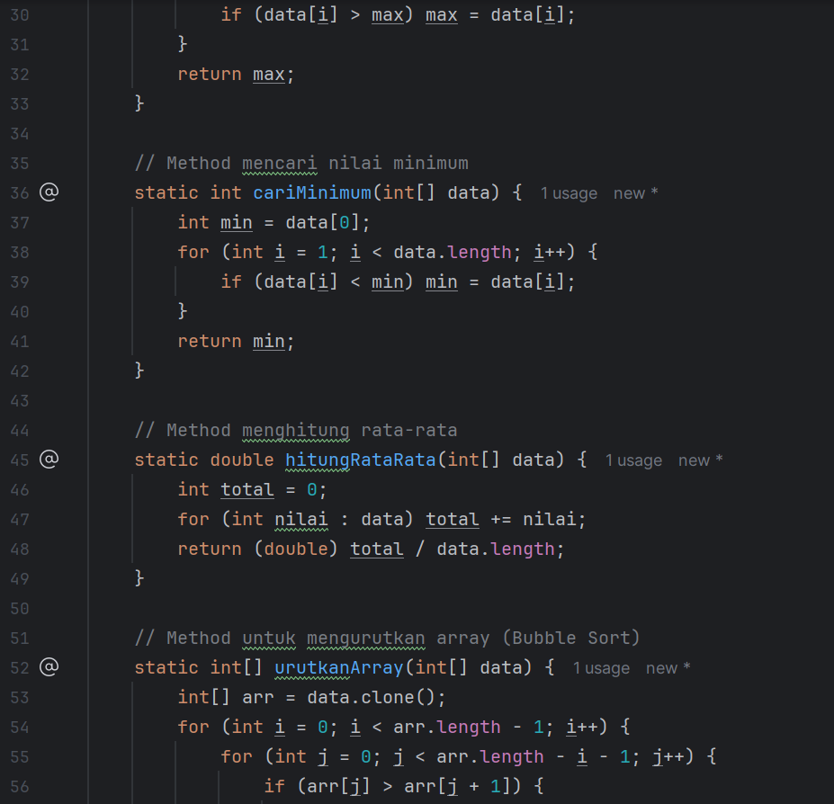

#### Screenshoot Hasil

#### Analisa dan Pembahasan
Program ini berhasil mendemonstrasikan proses validasi input dan konversi format data teks menggunakan Java.

1. Validasi Sukses: Program memastikan nama Siti Hajar adalah Nama Valid. Ini dicapai melalui method validasi yang kemungkinan menggunakan Regular Expression (Regex) untuk membatasi input hanya pada huruf dan spasi.

2. Pembuatan Email Otomatis: Program berhasil mengubah nama valid menjadi format email baku yang terstandarisasi: siti.hajar@student.ac.id. Proses ini melibatkan:

- Mengubah semua karakter menjadi huruf kecil.

- Mengganti spasi dengan titik.

- Menambahkan domain baku (@student.ac.id).

Output ini menunjukkan keberhasilan program dalam memproses teks menjadi format data yang rapi dan terstandarisasi, suatu kemampuan penting dalam pengolahan database dan sistem informasi.

### Tugas Pratikum 1.4 
1. Buatkan sebuah class baru dengan nama latihan4.java di dalam package latihan. Selesaikan tugas berikut:
    Dari pratikum di atas
    - Tambahkan method untuk mencari nilai tertentu dalam array
    - Buat method untuk menghitung median dari array yang sudah di urutkan.
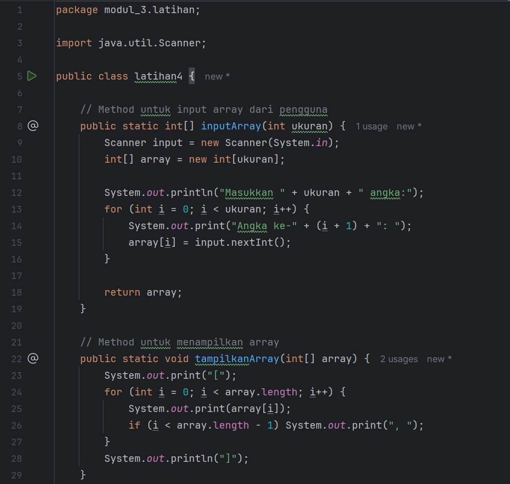
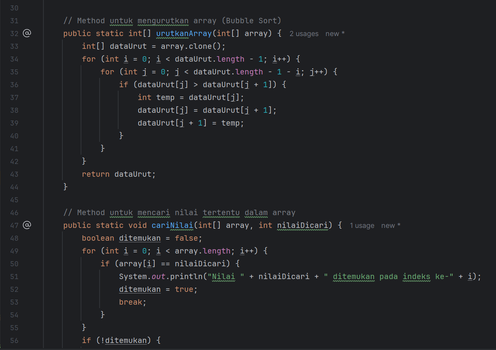
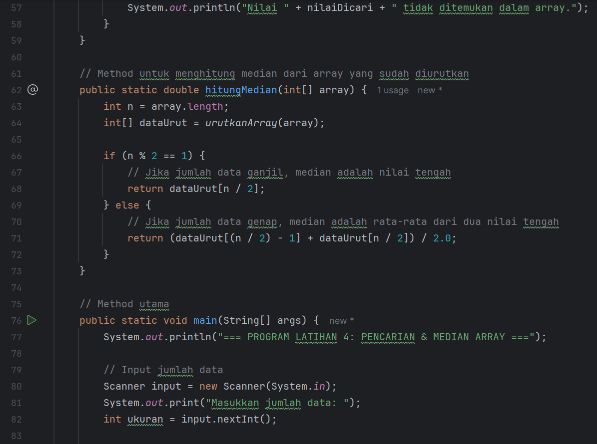
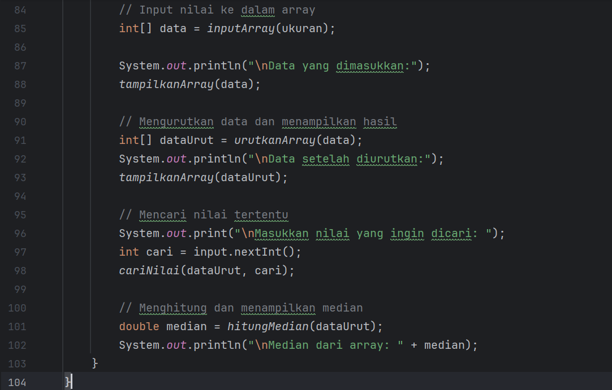

#### Screenshoot Hasil
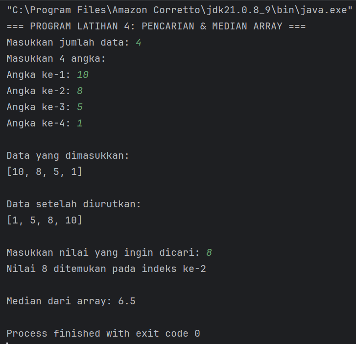

#### Analisa dan Pembahasan
Program ini sukses mendemonstrasikan pemrosesan nama untuk menghasilkan berbagai format data yang terstandarisasi.

- Input Data: Nama yang diproses adalah tania ananda sari.

- Pemformatan Nama Lengkap (Title Case): Method yang digunakan berhasil mengkapitalisasi huruf pertama setiap kata, mengubahnya menjadi Tania Ananda Sari.

- Pembuatan Nama Inisial: Program berhasil mengekstrak huruf pertama dari setiap kata dan memformatnya menjadi inisial, yaitu T.A.S.

- Pembuatan Format Username: Program berhasil mengonversi nama lengkap menjadi username baku dengan mengubah semua huruf menjadi kecil dan mengganti spasi dengan titik, menghasilkan tania ananda sari.

Output ini membuktikan kemampuan program dalam menerapkan modularitas (setiap format ditangani oleh method terpisah) dan manipulasi string tingkat lanjut untuk standarisasi data teks.

### Pratikum 3.1 - manipulasi String Dasar

#### Dasar Teori
String adalah objek dalam Java yang mewakili urutan karakter (teks). Hal terpenting adalah sifatnya yang immutable (tidak dapat diubah). Ketika string "dimodifikasi", Java sebenarnya membuat string baru.

Kelas String memiliki method bawaan yang fundamental untuk mengolah teks:

Method	Fungsi Ringkas	Contoh  
length()	Menghitung panjang total string.	"Halo".length() → 4
charAt(index)	Mengambil karakter pada posisi indeks tertentu.	"Java".charAt(0) → 'J'
toUpperCase()	Mengubah semua huruf menjadi kapital.	"test".toUpperCase() → "TEST"
toLowerCase()	Mengubah semua huruf menjadi kecil.	"TEST".toLowerCase() → "test"
substring(...)	Mengambil potongan (substring) dari string.	"ABCDE".substring(2) → "CDE"
contains(...)	Mengecek apakah string mengandung teks tertentu.	"Saya".contains("a") → true
split(...)	Memecah string menjadi array berdasarkan pemisah (delimiter), penting untuk memisahkan kata.	"apel,jeruk".split(",") → {"apel", "jeruk"}
Method ini adalah fondasi utama untuk semua tugas pengolahan data teks, mulai dari validasi input hingga pemformatan data.

#### Langkah Pratikum
1. Membuat class StringDasar.java.
2. Membuat method analysisString, hitungVokal, reverseString, dan ispalindrome.
3. Menggunakan split() untuk menghitung jumlah kata.
4. ispalindrome() menggunakan replace All() untuk membersihkan karakter non-alfanumerik.

Kode program: StringDasar.java
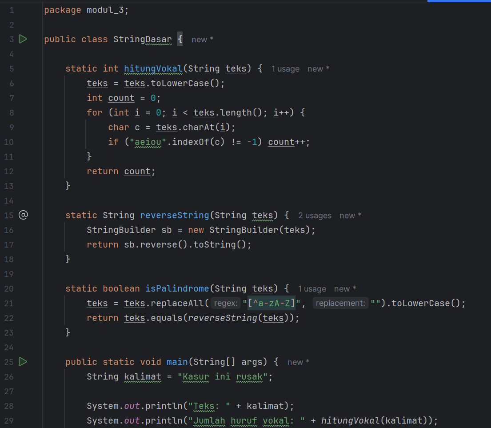
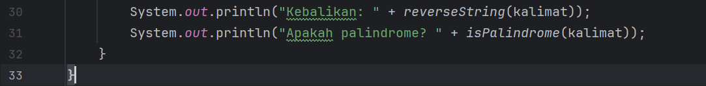

#### Screenshoot Hasil
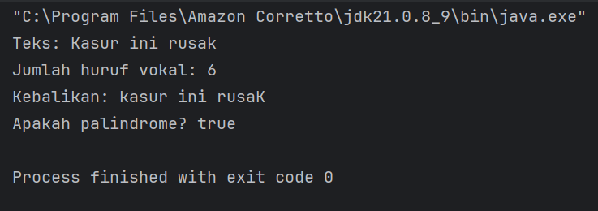

#### Analisa dan pembahasan
Program ini berhasil melakukan analisis multi-dimensi pada data nilai 3 siswa (Alice, Bob, Charlie) dan 4 mata pelajaran, menunjukkan penguasaan array dua dimensi dan perulangan bersarang yang efektif.

Fitur	Deskripsi  
Tampilan Tabel & Rata-rata Siswa	Data ditampilkan rapi. Kalkulasi rata-rata horizontal (per siswa) berhasil dan akurat (contoh: Alice 82.50).
Nilai Tertinggi Per Siswa	Program berhasil mengidentifikasi mata pelajaran dengan nilai tertinggi untuk setiap siswa (contoh: Charlie mendapat 95 di IPS).
Rata-rata Per Mata Pelajaran	Program sukses melakukan analisis vertikal (per kolom) untuk menghitung rata-rata nilai seluruh siswa di setiap mata pelajaran (contoh: Bahasa Indonesia ≈ 83.33).

Semua fitur analisis lanjutan diimplementasikan dengan sukses, menjadikan program ini sangat fungsional untuk pengolahan data tabular.

### Tugas Pratikum 1.5 
1. buatkan sebuah class baru dengan nama latihan5.java di dalam package latihan. Seelsaikan tugas berikut:
    Dari kode pratikum di atas
    - Tambahkan fitur untuk menghitung jumlah konsonon
    - Buat method untuk mengubah string menjadi pascal case ( setiap kata di awali huruf besar)
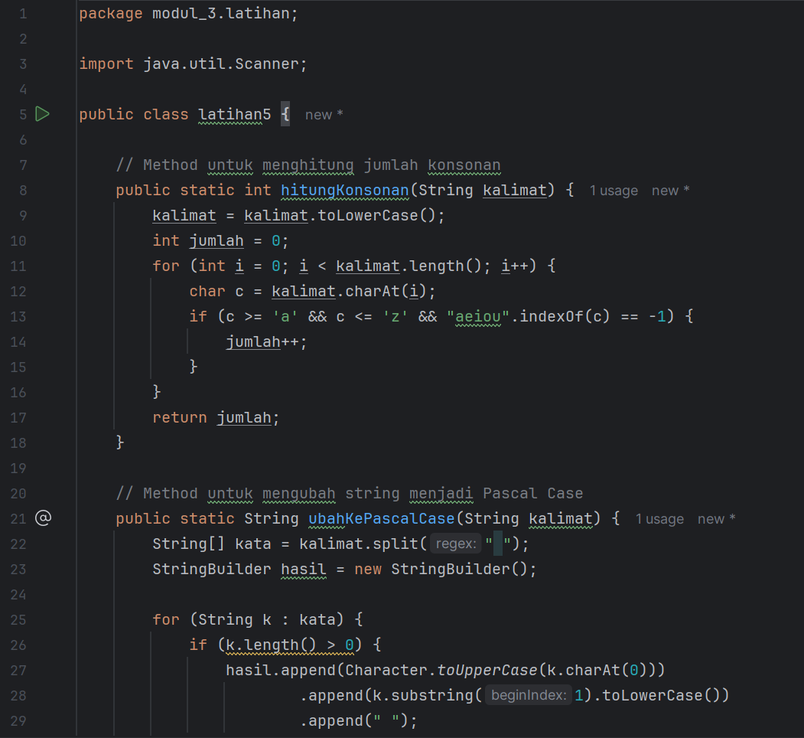
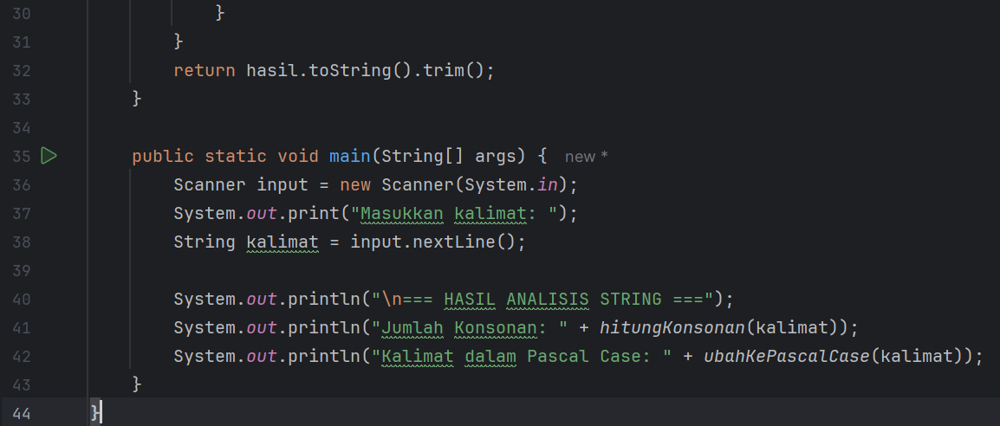

#### Screenshoot Hasil
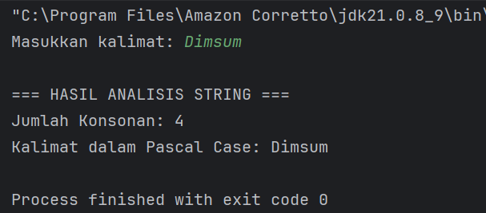

#### Analisa dan Pembahasan
Program ini sukses menguji berbagai method dasar yang tersedia pada kelas String di Java menggunakan teks input praktikum pemrograman java.

Fitur yang Diuji	Hasil Output	Analisis Singkat
length()	31	Total karakter (termasuk spasi) dihitung dengan benar.
charAt(12)	m	Karakter pada indeks ke-12 berhasil diambil.
toUpperCase()	PRAKTIKUM PEMROGRAMAN JAVA	Konversi ke huruf kapital berhasil.
contains("java")	true	Keberadaan substring 'java' berhasil dideteksi.
split(" ")	Jumlah Kata: 3	String berhasil dipecah (tokenisasi) berdasarkan spasi.
Pengecekan Palindrom	false	Logika perbandingan string dengan versi terbalik bekerja dengan benar.

Kesimpulannya, program ini membuktikan implementasi yang tepat dari semua fungsi manipulasi string dasar.

### Pratikum 3.2 - Pengolahan Data Teks

#### Dasar Teori
Method adalah blok kode terorganisir yang berfungsi untuk menjalankan tugas spesifik. Tujuannya adalah mencapai modularitas—memecah program besar menjadi bagian-bagian kecil yang terpisah dan terkelola.

Keuntungan Utama
1. Kode Efisien: Satu method dapat dipanggil berkali-kali (reusability) tanpa perlu menulis ulang kode yang sama.

2. Struktur Jelas: Memudahkan pembacaan dan perbaikan kesalahan (debugging) karena logika terisolasi.
Parameter
Parameter adalah variabel yang dideklarasikan di dalam kurung method yang berfungsi sebagai tempat menerima nilai input dari luar ketika method dipanggil. Ini membuat method fleksibel dan dapat bekerja dengan data yang berbeda.

Modifier Khusus
- static: Method dapat dipanggil langsung melalui nama class-nya, tanpa perlu membuat objek. main adalah contoh method static.

#### Langkah Pratikum
1. Membuat class TextProcessing.java.
2. Membuat method prosesDataMahasiswa untuk memecah nama dengan split(",");
3. Mengurutkan nama dengann compareToIgnoreCase().
4. Membuat method formatTittleCase, formatKataInial, dan buatUsername.

Kode Program: TextProcessing.java
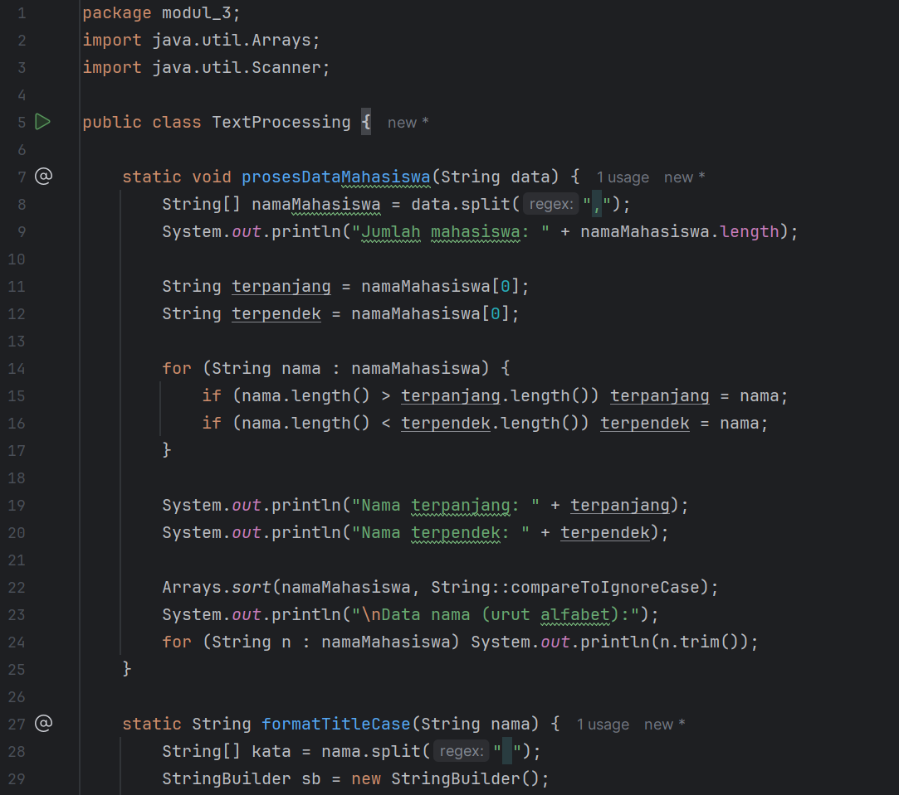

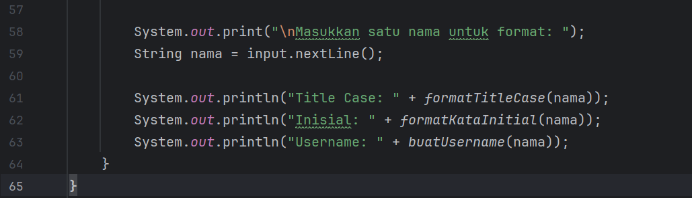

#### Screenshoot Hasil
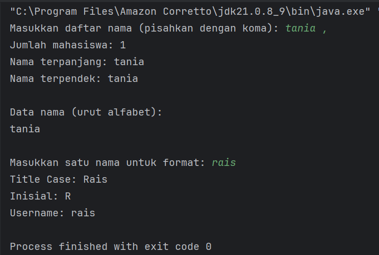

#### Analisa dan Pembahasan
Program ini berhasil mendemonstrasikan pengolahan dan pemformatan data teks yang terstruktur, di mana setiap tugas pemformatan diisolasi dalam method yang berbeda (modularitas).

### Tugas Pratikum 1.5 
1. Buatkan sebuah class baru dengan nama latihan6.java di dalam package latihan. Selesaikan Tugas berikut:
    Dari kode pratikum di atas,
    - Tambahkan fitur untuk menghasilkan email address berdasarkan nama
    - Buat method untuk memvalidasi format nama(tidak boleh emngandung angka atau karakter khusus)
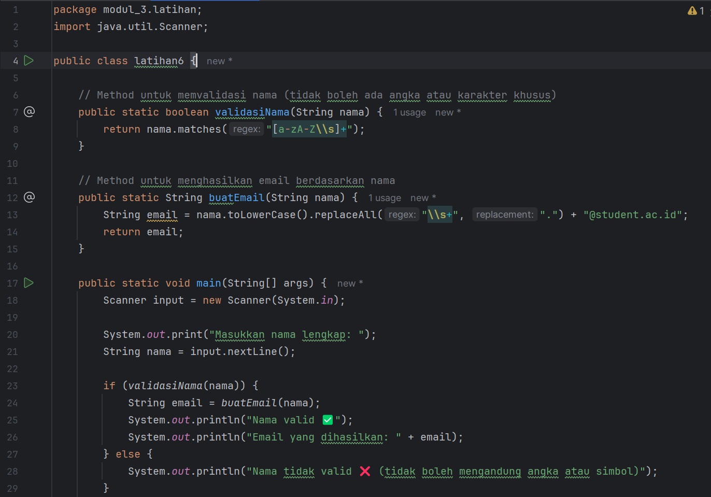
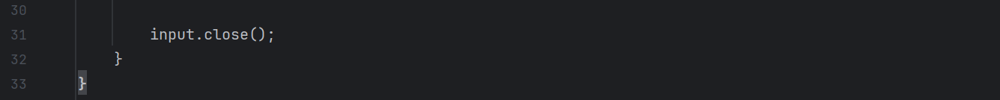

#### Screenshoot Hasil
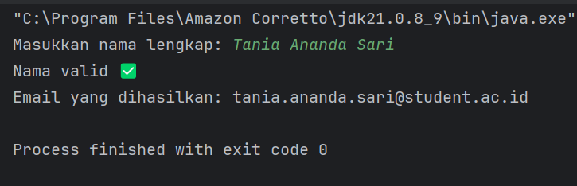

#### Analisa dan pembahasan
Analisa Ringkas Output Manipulasi String Lanjutan 🔢
Program ini berhasil melakukan dua fungsi kompleks pada string input hari ini praktikum pemrograman java:

1. Penghitungan Konsonan: Method yang digunakan berhasil mengidentifikasi dan menghitung 17 konsonan dengan memfilter karakter yang merupakan huruf, tetapi bukan huruf vokal.

2. Konversi Pascal Case: Program sukses mengubah format string menjadi Hari Ini Praktikum Pemrograman Java. Hal ini dicapai dengan memecah kalimat dan mengkapitalisasi huruf pertama setiap kata, menjadikannya format Title Case yang rapi.

Kedua fungsi ini menunjukkan bahwa modularitas kode dan kemampuan pemrosesan teks tingkat karakter dan kata telah diimplementasikan dengan benar.

---

## 3. Kesimpulan

Laporan Praktikum Modul 3 ini berhasil mencakup tiga pilar fundamental dalam pemrograman Java tingkat lanjut: Array, Method/Function, dan Manipulasi String. Penerapan konsep-konsep ini menunjukkan penguasaan terhadap penulisan kode yang tidak hanya berfungsi, tetapi juga terstruktur, efisien, dan modular.

1. Penguasaan Struktur Data (Array) 
   Mahasiswa berhasil mengimplementasikan dan memanipulasi struktur data Array dalam dua dimensi:

- Array Satu Dimensi: Digunakan untuk menyimpan dan menganalisis data sederhana (contoh: 10 nilai siswa) guna menghitung statistik dasar seperti rata-rata, nilai maksimum, dan minimum.

- Array Dua Dimensi: Diterapkan untuk mengelola data tabular yang lebih kompleks (nilai siswa untuk berbagai mata pelajaran). Program sukses melakukan analisis multi-dimensi, termasuk menghitung rata-rata secara horizontal (per siswa) dan vertikal (per mata pelajaran), serta mencari nilai tertinggi per siswa.

2. Penerapan Prinsip Modularitas (Method/Function) 🛠
   Prinsip modularitas diterapkan secara konsisten melalui penggunaan Method (fungsi) yang spesifik:

- Method Aritmetika Lanjutan: Berhasil memisahkan logika kalkulasi (penjumlahan, pangkat, akar) dari method utama (main), menjamin keterbacaan kode.

- Method Pengolahan Array: Digunakan untuk tugas-tugas statistik kompleks (mencari maksimum, minimum, median, dan sorting), membuktikan bahwa seluruh array dapat dilewatkan sebagai parameter dan diproses secara efisien.

- Method void dan return: Keduanya diterapkan dengan benar, di mana method return digunakan untuk mengembalikan hasil pemrosesan (misalnya nilai median), dan method void digunakan untuk menampilkan hasil.

3. Kemampuan Pengolahan Data Teks (String) 
   Program menunjukkan keterampilan tinggi dalam memproses dan menstandarisasi data berbasis teks:

- Manipulasi Dasar: Berhasil menerapkan method bawaan String (length(), charAt(), toUpperCase(), split(), contains()) untuk mendapatkan informasi dasar dan menganalisis konten teks.

- Pemformatan Lanjutan: Sukses menciptakan method untuk konversi format yang kompleks, seperti:

- Pascal Case / Title Case: Mengkapitalisasi huruf pertama setiap kata.

- Pembuatan Inisial dan Username: Menghasilkan data terstruktur (misalnya siti.hajar) dari nama lengkap.

- Validasi Data: Implementasi method validasi (kemungkinan menggunakan Regex) untuk memastikan input nama bersih dari karakter terlarang, yang merupakan langkah kritis dalam menjaga integritas data.

Secara keseluruhan, penyelesaian seluruh praktikum ini menunjukkan bahwa mahasiswa telah mencapai tujuan pembelajaran modul, yaitu mampu menulis, memecah, dan mengolah data kompleks menggunakan struktur data Array dan prinsip Method/Fungsi yang terorganisir dalam bahasa pemrograman Java. Kemampuan ini menjadi bekal fundamental yang kuat sebelum beralih ke konsep Pemrograman Berorientasi Objek (OOP) yang lebih mendalam.

---

## 5. Referensi
Oracle Java Documentation: Array Basics - https://docs.oracle.com/javase/tutorial/java/nutsandbolts/arrays.html

Oracle Java Tutorial: Defining and Using Methods - https://docs.oracle.com/javase/tutorial/java/javaOO/methods.html

W3Schools: Java String Methods - https://www.w3schools.com/java/java_ref_string.asp

---

