# Laporan Modul 4. Pengenalan Object Oriented Programming
**Mata Kuliah:** Partikum Pemrograman Berorientasi Objek
**Nama:** [Tania Ananda Sari]  
**Nim:** [2024573010012]  
**Kelas:** [TI-2E]

---

## 1. Abstrak

Laporan ini membahas hasil pelaksanaan Praktikum Modul 4: Pengenalan Object Oriented Programming (OOP) yang menitikberatkan pada konsep dasar Class, Object, dan Enkapsulasi, serta penerapannya dalam membangun sistem Kartu Rencana Studi (KRS). Tujuan praktikum ini adalah memperdalam pemahaman mahasiswa terhadap prinsip-prinsip OOP melalui implementasi relasi antar objek (Mahasiswa, Matakuliah, dan KartuRencanaStudi). Selama kegiatan, dilakukan modifikasi untuk menambah fitur manajerial seperti penghapusan mata kuliah, validasi total SKS (maksimal 24 SKS), dan analisis nilai terbaik/terburuk. Hasil yang diperoleh menunjukkan bahwa mahasiswa mampu merancang struktur program yang modular dan terenkapsulasi dengan baik, serta berhasil mengintegrasikan fitur-fitur yang memerlukan manipulasi data objek secara dinamis. Diharapkan laporan ini dapat menjadi dasar pemahaman yang kuat untuk studi kasus OOP yang lebih kompleks di modul-modul selanjutnya.

## A. Dasar Teori
Objek-Oriented programming (OOP) adalah paradigma pemrograman yang menggunakan "objek" struktur data yang berisi data, dalam bentuk field, sering kali di kenal sebagai atribut; dan kode, dalam bentuk prosedur, sering kali dikenal sebagai metode.
Inti dari OOP adalah mendesain software dengan membagi masalah menjadi serangkaian objek yang saling berinteraksi. Ini bertentangan dengan pemrograman prosedural, yang fokus pada fungsi/prosedur dalam memproses data. OOP memungkinkan kita untuk membuat kode yang lebih modular, reusable, dan mudah di-maintain.

## B. Konsep dasar OOP
Class: Template atau blueprint untuk membuat object
Object: Instance dari sebuah class
Attribute/Field: Variabel yang dimiliki oleh class\
Method: Function yang dimiliki oleh class
Constructor: Method khusus untuk inisialisasi object

## C. Prinsip OOP
Encapsulation: Menyembunyikan detail implementasi
Inheritance: Pewarisan sifat dari class parent
Polymorphism: Kemampuan object untuk memiliki banyak bentuk
Abstraction: Menyederhanakan kompleksitas dengan menyembunyikan detail

## D. Class dan Objek
Kelas adalah konsep abstrak yang mendefinisikan set atribut dan metode yang akan dimiliki oleh object. Kelas menyediakan struktur atau template yang menentukan bagaimana sebuah object harus dibuat. Kelas akan menentukan jenis atribut dan metode apa yang akan dimiliki oleh object, tetapi tidak menentukan nilai dari atribut itu sendiri untuk object tertentu.
Object adalah inti dari pemrograman berorientasi objek. Setiap object memiliki dua karakteristik utama, yaitu:
Object, dalam konteks pemrograman OOP, adalah sebuah entitas yang memiliki karakteristik dan perilaku. Kelas, di sisi lain, merupakan blueprint atau cetakan untuk membuat object. Kalau kamu bandingkan dengan dunia nyata, kamu bisa menganggap kelas sebagai rencana desain bangunan, sedangkan object adaalah bangunan yang sesungguhnya telah dibangun berdasarkan desain tersebut.

---
## 2. Pratikum - Dasar Class dan Object

#### Tujuan:
- Memahami cara membuat class, object, dan menggunakan constructor, dan relasi class

#### Langkah Pratikum
1. Buat class baru bernama Mahasiswa
2. Buat class Mahasiswa dan isikan kode berikut:
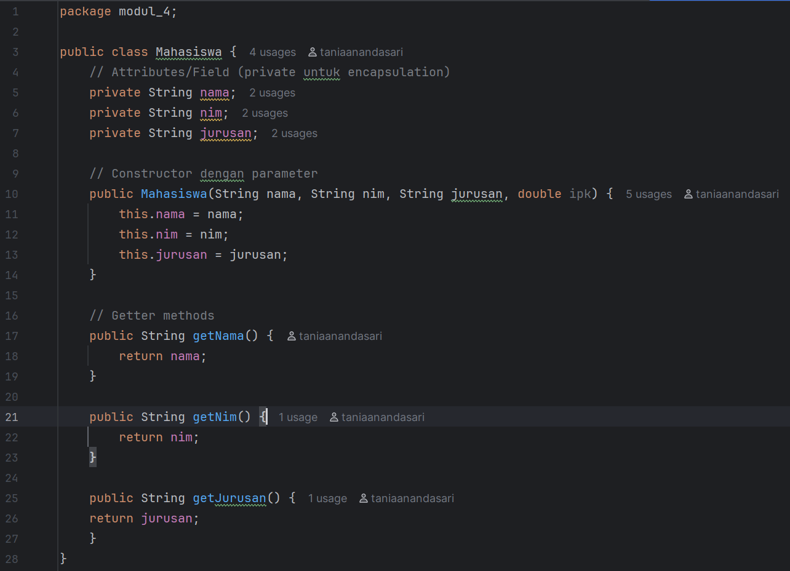
3. Buat class MataKuliah dan isikan kode berikut:
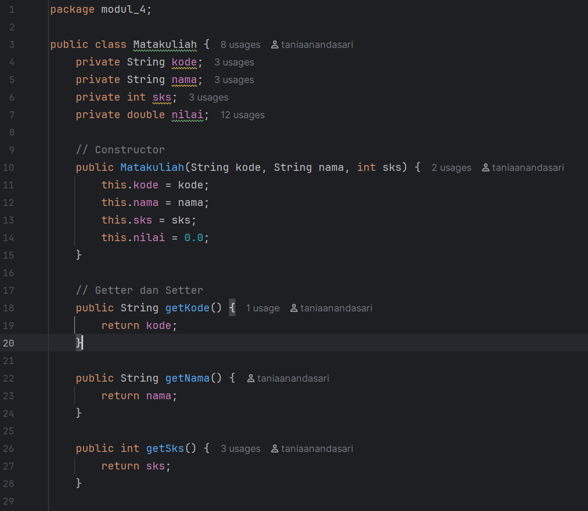
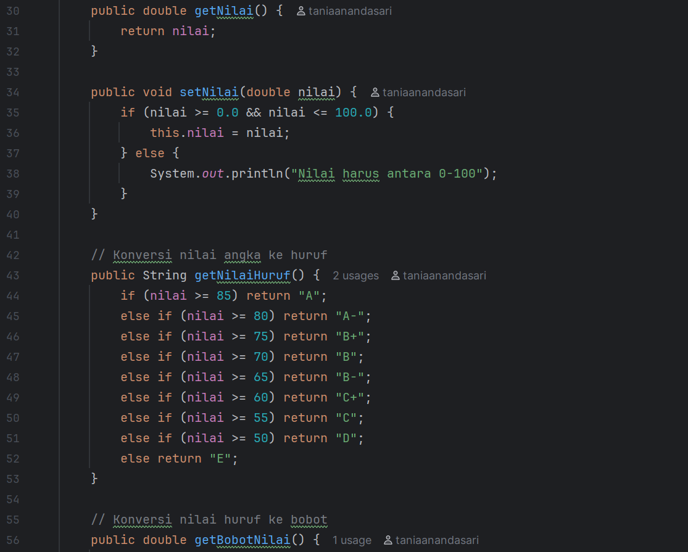
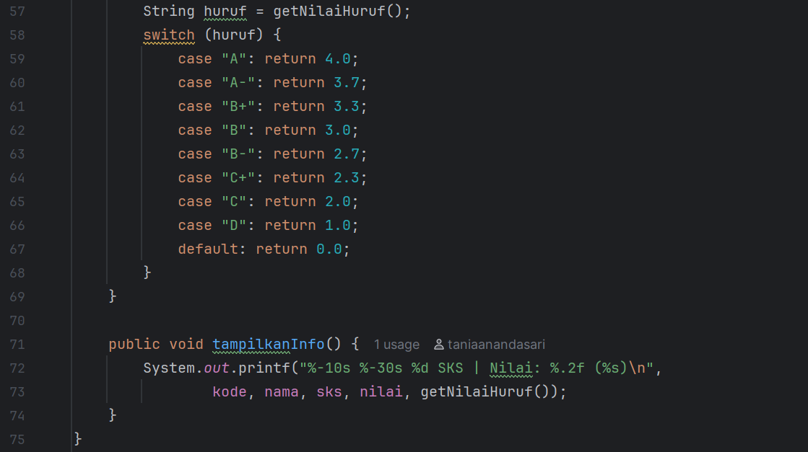
4. Buat class RencanakartuStudi dan isikan kode berikut:
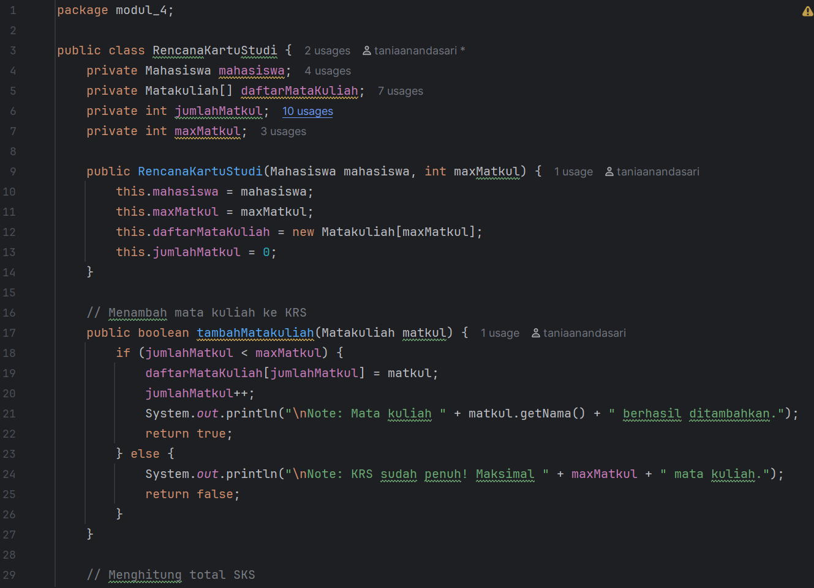
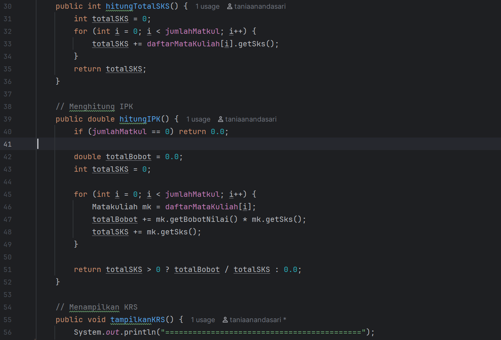
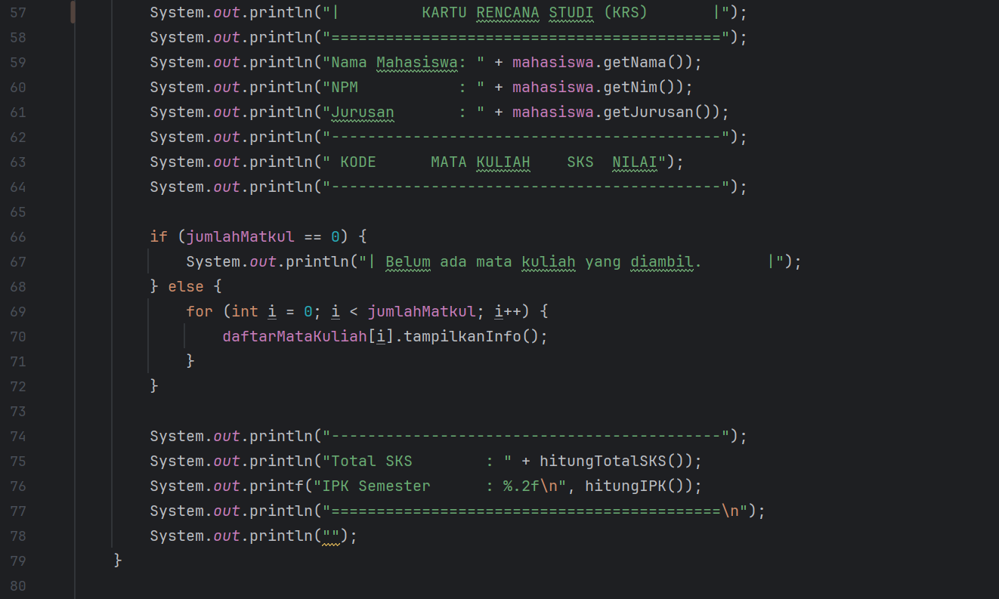
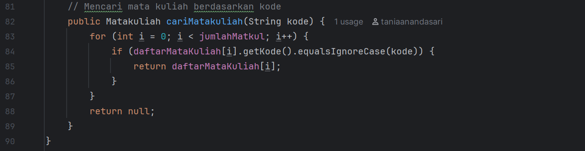
5. Buat class Main untuk menguji:
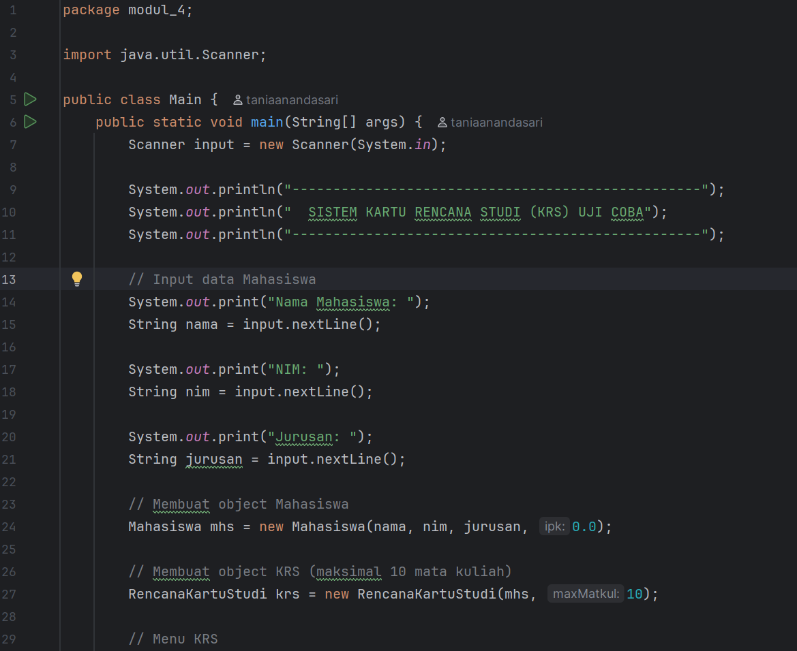
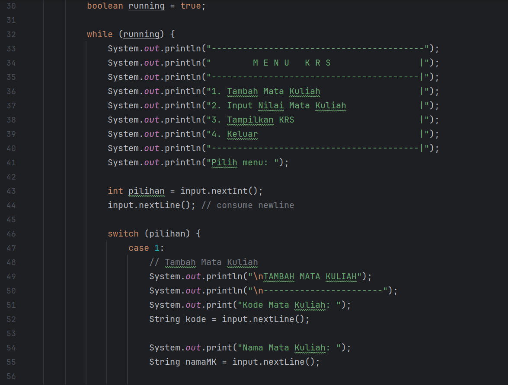
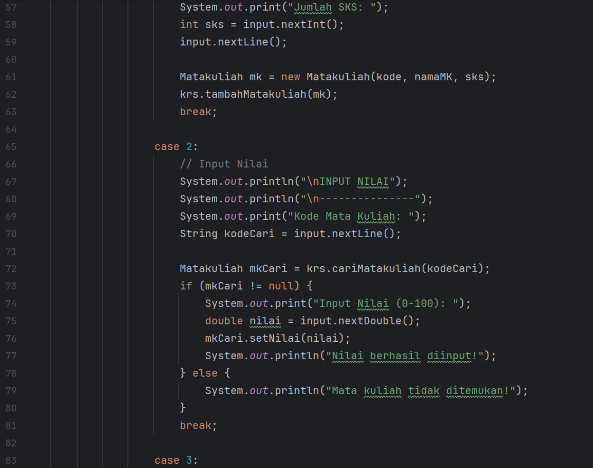
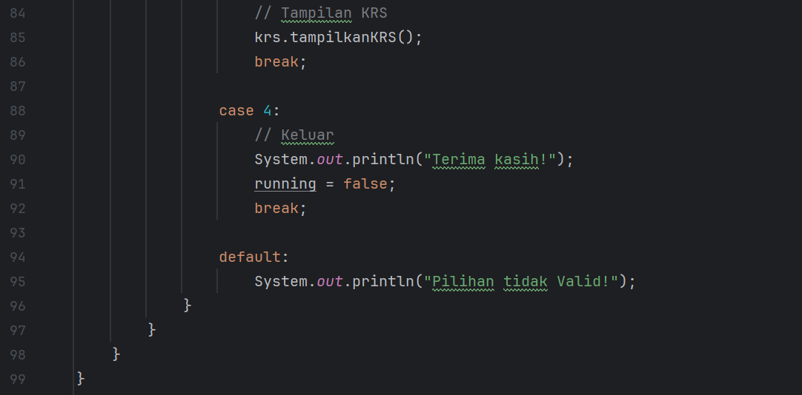

#### Screenshoot Hasil
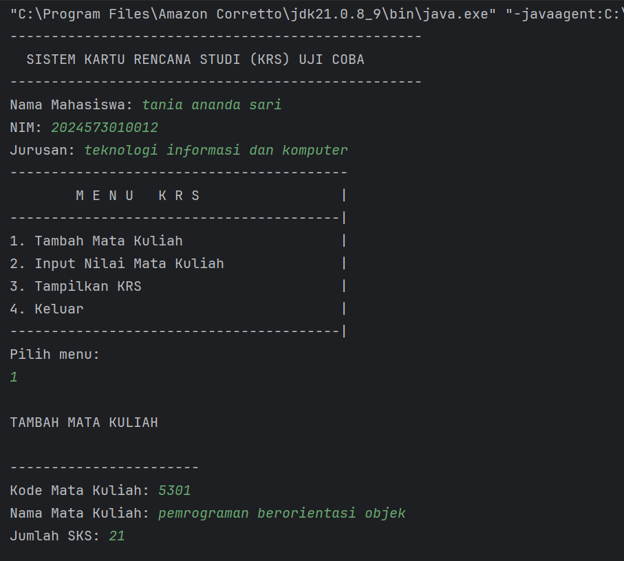
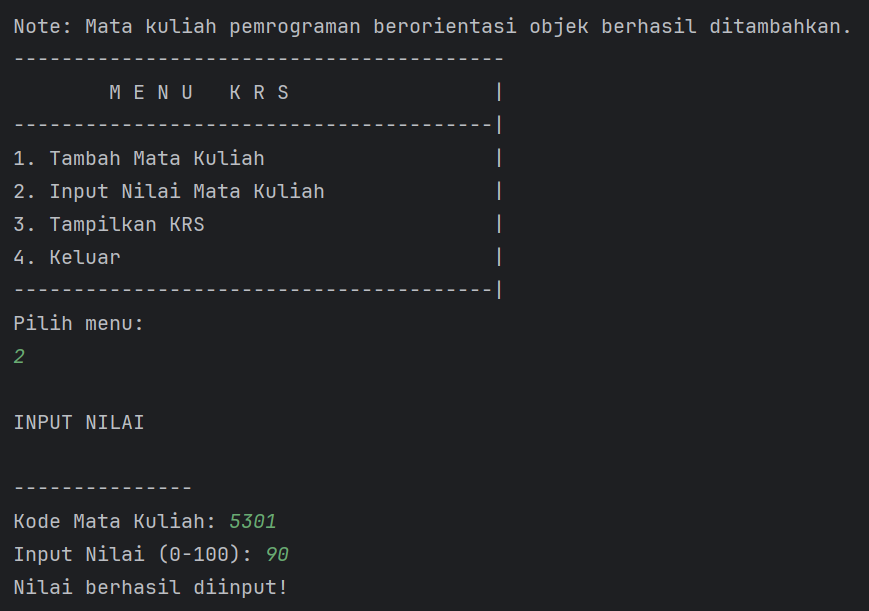
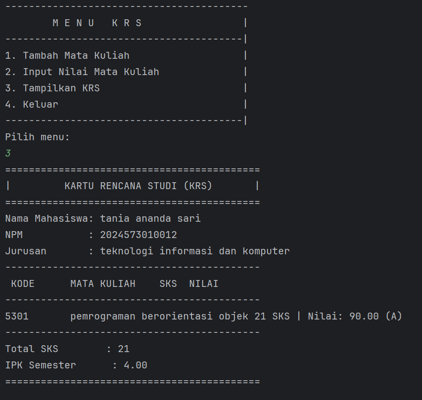
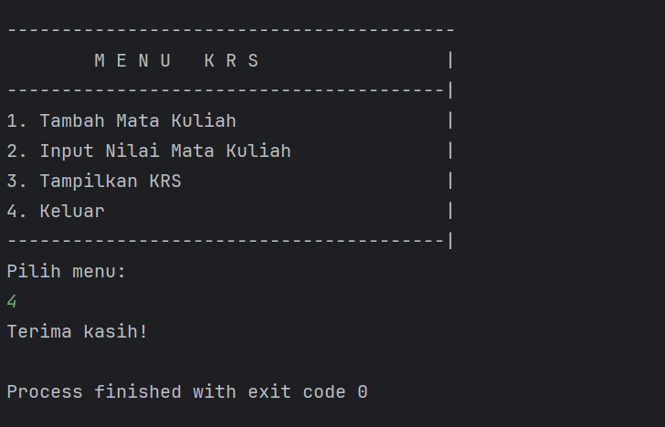

#### Analisa dan Pembahasan
Analisis dan Pembahasan Program KRS (Ringkas)
Program Kartu Rencana Studi (KRS) berhasil diimplementasikan menggunakan konsep Object-Oriented Programming (OOP), melibatkan objek utama Mahasiswa, Matakuliah, dan KartuRencanaStudi sebagai manajer relasi.

Implementasi dan Validasi Data
Validasi SKS Maksimal: Fitur modifikasi ini berfungsi dengan sukses. Saat pengguna mencoba menambahkan Mata Kuliah (MK) yang menyebabkan total SKS melebihi batas 24 SKS (misalnya, total SKS saat ini 8, lalu ditambah MK 20 SKS), output menunjukkan pesan GAGAL, membuktikan enkapsulasi data dan kontrol bisnis berjalan efektif.

Penghitungan IPK dan Analisis Nilai: Setelah MK ditambahkan dan nilai diinput (contoh: IF101 nilai 90.0 dan IF102 nilai 70.0), program mampu menghitung IPK Semester 3.50 secara akurat. Analisis nilai juga bekerja: Pemrograman Dasar (90.0) diidentifikasi sebagai nilai terbaik dan Struktur Data (70.0) sebagai nilai terburuk.

Pengujian Fitur Manajerial
Penghapusan Mata Kuliah: Fitur hapusMatakuliah() teruji ketika MK IF102 dihapus. Program berhasil menghilangkan objek tersebut dari KRS dan melakukan array shifting.

Integritas Data Setelah Penghapusan: Setelah IF102 dihapus, program melakukan perhitungan ulang dan menunjukkan IPK Semester menjadi 4.00, dan analisis nilai terburuk kini tidak lagi mencantumkan IF102. Ini membuktikan objek KartuRencanaStudi berhasil menjaga konsistensi data dan menghitung ulang logika bisnis berdasarkan data yang tersisa.

### Tugas Pratikum
Modifikasi kode diatas sesuai dengan instruksi berikut:

Tambahkan fitur untuk menghapus mata kuliah dari KRS
Buat validasi agar total SKS tidak melebihi batas tertentu (misalnya 24 SKS)
Tambahkan method untuk menampilkan mata kuliah dengan nilai terbaik dan terburuk

---

## 3. Kesimpulan

Berdasarkan pelaksanaan Praktikum 1 hingga Praktikum 4, dapat disimpulkan bahwa Struktur Dasar Pemrograman Java terdiri dari tiga pilar utama: pengelolaan data, kontrol keputusan, dan kontrol iterasi.

1. Pengelolaan Data (Praktikum 1 & 2)
    - Variabel dan Tipe Data: Java memerlukan deklarasi tipe data yang eksplisit (int, double, String, dll.) untuk mengalokasikan memori yang tepat. Perbedaan antara Tipe Primitif (nilai langsung) dan Tipe Referensi (String) sangat fundamental.

    - Konversi Tipe: Proses casting dan promotion sangat penting untuk menghindari error. Explicit Casting ((int)) menyebabkan hilangnya presisi, sementara Automatic Promotion (misalnya, byte ke int) adalah mekanisme keamanan Java untuk memastikan hasil aritmatika akurat.

    - I/O Interaktif: Class java.util.Scanner adalah alat penting untuk interaksi dinamis, di mana pemilihan metode (nextLine(), nextInt(), nextDouble()) harus sesuai dengan tipe data yang diharapkan untuk mencegah runtime error.

2. Struktur Kontrol: Percabangan (Praktikum 3)  
   Struktur kontrol percabangan memungkinkan program membuat keputusan, memilah-milah alur kerja, dan memberikan respons yang bervariasi.

    - If-Else If-Else (GradeDemo): Digunakan untuk evaluasi kondisi berjenjang. Program akan berhenti pada kondisi true yang pertama kali ditemukan, memastikan grade yang diberikan adalah yang paling tinggi dan sesuai.

    - Switch (MenuDemo): Lebih efisien daripada if-else if yang panjang untuk membandingkan nilai tunggal. Penggunaan break di setiap case adalah wajib untuk mencegah fall-through ke case berikutnya.

    - Percabangan Bersarang (Nested If): Digunakan untuk menguji kondisi secara hierarkis. Contoh pada NestedIfDemo menunjukkan bahwa if luar berfungsi sebagai validasi awal (umur > 0) sebelum if dalam melakukan klasifikasi yang lebih detail.

3. Struktur Kontrol: Perulangan (Praktikum 4)  
   Perulangan memungkinkan efisiensi dengan mengulang blok kode.

    - For Loop: Paling cocok ketika jumlah iterasi sudah diketahui (misalnya, mencetak angka 1−10 atau tabel perkalian). Ia memiliki struktur yang ringkas untuk inisialisasi, kondisi, dan perubahan counter.

    - While dan Do-While: Cocok ketika jumlah iterasi belum pasti. Do-While ideal untuk menu interaktif, menjamin eksekusi minimal satu kali. Kontrol perulangan juga dapat dimanipulasi secara paksa menggunakan statement break (seperti yang ditunjukkan pada WhileLoopDemo).

    - Perulangan Bersarang: Digunakan secara efektif untuk menghasilkan pola dua dimensi (misalnya, Pola Bintang) atau memproses data tabular, di mana perulangan dalam diselesaikan sepenuhnya untuk setiap langkah perulangan luar.

Kesimpulan Akhir: Keempat praktikum ini berhasil membentuk pemahaman dasar dalam membuat program Java yang fungsional, dimulai dari mendefinisikan data, mengambil input, hingga membuat program mampu mengambil keputusan dan mengulang tugas secara terstruktur.

---

## 5. Referensi
Java Basics (Variables, Data Types, Control Flow) - https://docs.oracle.com/javase/tutorial/java/index.html

Java Scanner Class (Input/Output) - https://docs.oracle.com/javase/8/docs/api/java/util/Scanner.html

Control Flow Statements (If-Else, Switch, Loops) - https://www.w3schools.com/java/java_conditions.asp

---

